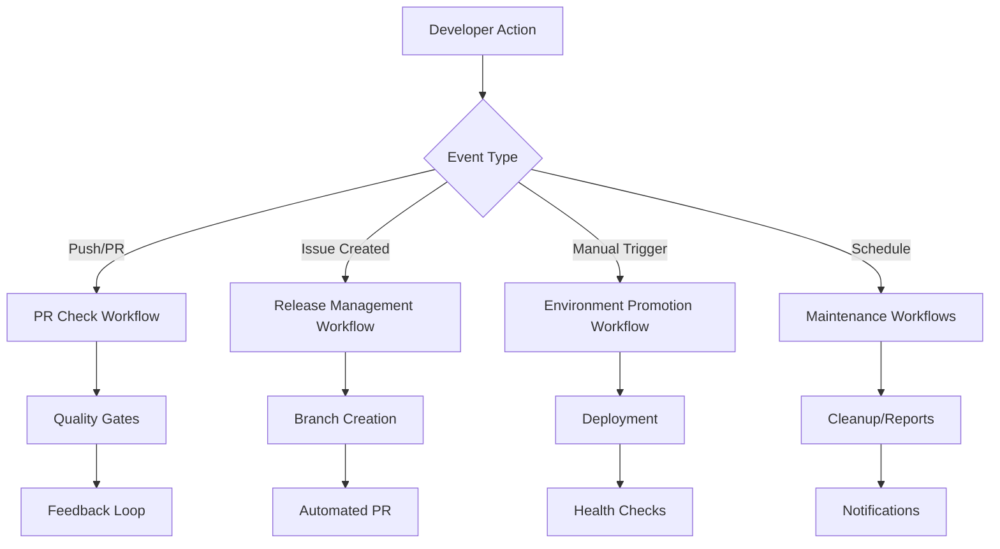
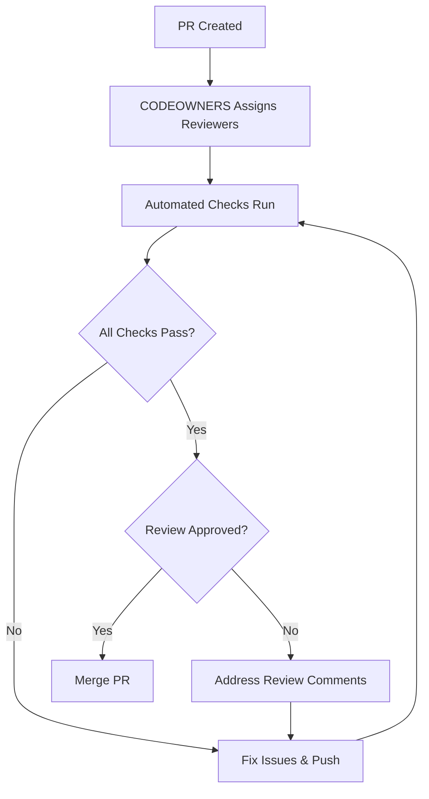

# 🎓 Complete DevOps Learning Guide

This comprehensive guide provides hands-on learning for advanced DevOps practices using our Spring Boot GitFlow Demo repository. This is designed to take you from beginner to expert level in modern DevOps practices.

## 📋 Table of Contents
1. [Prerequisites & Setup](#0-prerequisites--setup)
2. [Automated Workflows](#1-automated-workflows)
3. [Branch Protection](#2-branch-protection)
4. [Quality Gates](#3-quality-gates)
5. [Code Review Automation](#4-code-review-automation)
6. [Version Management](#5-version-management)
7. [Multi-Environment Deployment](#6-multi-environment-deployment)
8. [Monitoring & Observability](#7-monitoring--observability)
9. [Security & Compliance](#8-security--compliance)
10. [Performance & Optimization](#9-performance--optimization)
11. [Troubleshooting Guide](#10-troubleshooting-guide)
12. [Hands-On Exercises](#11-hands-on-exercises)
13. [Advanced Concepts](#12-advanced-concepts)
14. [Real-World Scenarios](#13-real-world-scenarios)
15. [Best Practices Compendium](#14-best-practices-compendium)
16. [Career Development](#15-career-development)

---

## 0. 📚 Prerequisites & Setup

### Required Knowledge (Beginner Level)
- Basic Git commands (`clone`, `commit`, `push`, `pull`, `branch`)
- Understanding of command line interface
- Basic Java/Spring Boot concepts
- YAML syntax fundamentals
- Basic understanding of web applications

### Tools Installation & Configuration

#### 1. Essential Tools Setup
```bash
# Install Homebrew (macOS)
/bin/bash -c "$(curl -fsSL https://raw.githubusercontent.com/Homebrew/install/HEAD/install.sh)"

# Install Git
brew install git
git config --global user.name "Your Name"
git config --global user.email "your.email@example.com"

# Install GitHub CLI
brew install gh
gh auth login

# Install Java 21
brew install openjdk@21
echo 'export PATH="/opt/homebrew/opt/openjdk@21/bin:$PATH"' >> ~/.zshrc
source ~/.zshrc

# Install Maven
brew install maven

# Install Docker
brew install --cask docker
# Start Docker Desktop application

# Install Node.js (for some tools)
brew install node

# Install kubectl (Kubernetes CLI)
brew install kubectl

# Install Helm (Kubernetes package manager)
brew install helm
```

#### 2. IDE Setup (VS Code)
```bash
# Install VS Code
brew install --cask visual-studio-code

# Install essential extensions
code --install-extension ms-vscode.vscode-java-pack
code --install-extension redhat.vscode-yaml
code --install-extension ms-azuretools.vscode-docker
code --install-extension github.vscode-github-actions
code --install-extension sonarsource.sonarlint-vscode
code --install-extension ms-kubernetes-tools.vscode-kubernetes-tools
```

#### 3. Environment Verification
```bash
# Verify installations
java --version    # Should show Java 21
mvn --version     # Should show Maven 3.9+
docker --version  # Should show Docker version
gh --version      # Should show GitHub CLI
kubectl version --client  # Should show kubectl version

# Clone the demo repository
git clone https://github.com/Sri2614/spring-boot-gitflow-demo.git
cd spring-boot-gitflow-demo

# Test the application
mvn clean test
mvn spring-boot:run
```

### Understanding the Repository Structure
```
spring-boot-gitflow-demo/
├── .github/                    # GitHub-specific configurations
│   ├── actions/               # Custom GitHub Actions
│   │   ├── build-and-publish/ # Custom action for building
│   │   ├── bump-version/      # Version management action
│   │   └── extract-version/   # Version extraction action
│   ├── ISSUE_TEMPLATE/        # Issue templates
│   │   ├── hotfix.md
│   │   ├── major-release.md
│   │   └── minor-release.md
│   ├── workflows/             # GitHub Actions workflows
│   │   ├── build-deploy-dev.yml    # Development deployment
│   │   ├── promote-environment.yml  # Environment promotion
│   │   ├── pull-request-check.yml  # PR validation
│   │   └── start-release-hotfix.yml # Release management
│   └── CODEOWNERS            # Code review assignments
├── docs/                     # Documentation
│   ├── BRANCH_PROTECTION.md  # Branch protection guide
│   └── DEVOPS_LEARNING_GUIDE.md # This guide
├── src/                      # Application source code
│   ├── main/
│   │   ├── java/             # Java source files
│   │   └── resources/        # Configuration files
│   │       ├── application.yml       # Base configuration
│   │       ├── application-dev.yml   # Development config
│   │       ├── application-tst.yml   # Test config
│   │       ├── application-uat.yml   # UAT config
│   │       └── application-prod.yml  # Production config
│   └── test/                 # Test files
├── target/                   # Build output (generated)
├── pom.xml                   # Maven configuration
├── README.md                 # Project overview
├── CHANGELOG.md              # Version history
└── setup.sh                  # Setup script
```

---

## 1. 🔄 Automated Workflows - Deep Dive

### 🎯 What are Automated Workflows?
Automated workflows are **event-driven processes** that execute specific tasks when triggered by repository events. They represent the backbone of modern DevOps practices, enabling:

- **Continuous Integration (CI)**: Automated testing and validation
- **Continuous Deployment (CD)**: Automated deployment to various environments
- **Release Management**: Automated version bumping and release processes
- **Code Quality Assurance**: Automated code analysis and security scanning
- **Notification Systems**: Automated team communication

### 🏗️ Workflow Architecture

Our repository implements a **multi-layered workflow architecture**:



### 📊 Workflow Event Matrix

| Event Type | Trigger Conditions | Workflows Activated | Business Impact |
|------------|-------------------|-------------------|------------------|
| `push` | Code pushed to protected branches | Development deployment | Fast feedback |
| `pull_request` | PR opened/updated/synchronized | PR validation, quality gates | Code quality |
| `issues` | Issue with specific labels | Release/hotfix automation | Process automation |
| `workflow_dispatch` | Manual execution | Environment promotions | Controlled deployments |
| `schedule` | Time-based (cron) | Maintenance, reports | Operational efficiency |
| `workflow_run` | After another workflow | Deployment pipeline | Orchestration |
| `release` | GitHub release created | Production deployment | Release automation |

### 🔍 Types of Workflows in Our Repository (Detailed Analysis)

#### A. Pull Request Check Workflow (Comprehensive Analysis)
**File**: `.github/workflows/pull-request-check.yml`  
**Purpose**: Comprehensive code quality validation before merging  
**Complexity Level**: ⭐⭐⭐⭐ (Advanced)  
**Average Execution Time**: 5-8 minutes  
**Resource Usage**: 2 vCPUs, 7GB RAM  

```yaml
name: Pull Request Check
on:
  pull_request:
    branches: [ main, master, develop, 'release/*', 'hotfix/*', 'feature/*' ]
    types: [ opened, synchronize, reopened ]
    # Additional trigger conditions for advanced scenarios
    paths-ignore: 
      - 'docs/**'
      - '*.md'
      - '.gitignore'
```

**🔍 Detailed Step-by-Step Analysis:**

##### Phase 1: Environment Preparation (30-60 seconds)
```yaml
- name: Checkout code
  uses: actions/checkout@v4
  with:
    ref: ${{ github.head_ref }}  # Ensures we get the PR branch
    fetch-depth: 0               # Full history for analysis
```
**Why this matters:**
- `fetch-depth: 0` enables advanced Git analysis
- `ref: ${{ github.head_ref }}` ensures we test the exact PR content
- Full checkout enables file-based conditional logic

##### Phase 2: Build Environment Setup (1-2 minutes)
```yaml
- name: Set up Java ${{ matrix.java }}
  uses: actions/setup-java@v3
  with:
    java-version: ${{ matrix.java }}
    distribution: 'temurin'      # Eclipse Temurin (recommended)
    cache: maven                 # Automatic Maven cache
```
**Advanced Configuration Options:**
```yaml
# Matrix strategy for multiple Java versions
strategy:
  matrix:
    java: [17, 21]  # Test compatibility across versions
    os: [ubuntu-latest, windows-latest]  # Multi-OS testing
  fail-fast: false  # Continue testing other versions if one fails
```

##### Phase 3: Dependency Management (30-90 seconds)
```yaml
- name: Cache Maven dependencies
  uses: actions/cache@v3
  with:
    path: ~/.m2
    key: ${{ runner.os }}-m2-${{ hashFiles('**/pom.xml') }}
    restore-keys: |
      ${{ runner.os }}-m2-
```
**Cache Strategy Explained:**
- **Primary Key**: OS + Maven + POM hash (exact match)
- **Fallback Keys**: Partial matches for faster builds
- **Cache Hit Rate**: Typically 80-90% for established projects
- **Time Savings**: 2-5 minutes per build

##### Phase 4: Code Compilation & Validation (1-3 minutes)
```yaml
- name: Extract version information
  id: version
  uses: ./.github/actions/extract-version
  # Custom action that extracts version from pom.xml

- name: Run tests with coverage
  run: |
    mvn clean test -B \
      -Dmaven.test.failure.ignore=false \
      -Djacoco.skip=false \
      -Dspring.profiles.active=test
```
**Test Execution Deep Dive:**
- `-B` (batch mode): No interactive prompts
- `failure.ignore=false`: Fail fast on test failures
- `jacoco.skip=false`: Ensure coverage calculation
- Profile-specific testing for isolation

##### Phase 5: Security Analysis (2-4 minutes)
```yaml
- name: OWASP Dependency Check
  run: |
    mvn org.owasp:dependency-check-maven:check -B \
      -DfailBuildOnCVSS=7 \
      -DskipTestScope=false \
      -Dformats=HTML,XML,JSON
  continue-on-error: true  # Don't block on vulnerabilities
```
**Security Scanning Configuration:**
- **CVSS Threshold**: 7.0 (High severity)
- **Scope**: All dependencies including test scope
- **Output Formats**: Multiple formats for different tools
- **Fail Strategy**: Continue but report issues

##### Phase 6: Code Quality Analysis (1-3 minutes)
```yaml
- name: SonarCloud Scan
  uses: SonarSource/sonarcloud-github-action@master
  env:
    GITHUB_TOKEN: ${{ secrets.GITHUB_TOKEN }}
    SONAR_TOKEN: ${{ secrets.SONAR_TOKEN }}
  with:
    args: >
      -Dsonar.projectKey=spring-boot-gitflow-demo
      -Dsonar.organization=${{ github.repository_owner }}
      -Dsonar.coverage.jacoco.xmlReportPaths=target/site/jacoco/jacoco.xml
      -Dsonar.java.coveragePlugin=jacoco
```
**Quality Gate Metrics:**
- **Code Coverage**: Minimum 80%
- **Duplicated Lines**: Maximum 3%
- **Maintainability Rating**: A or B
- **Reliability Rating**: A
- **Security Rating**: A

##### Phase 7: Container Verification (2-5 minutes)
```yaml
- name: Build Docker image (verification)
  run: |
    # Build image without pushing
    mvn jib:dockerBuild -Pdocker-local -DskipTests
    
    # Run container health check
    docker run -d --name app-test -p 8081:8080 \
      spring-boot-gitflow-demo:latest
    
    # Wait for application startup
    sleep 30
    
    # Health check
    curl -f http://localhost:8081/actuator/health || exit 1
    
    # Cleanup
    docker stop app-test && docker rm app-test
```

##### Phase 8: Results & Feedback (30-60 seconds)
```yaml
- name: Generate test report
  uses: dorny/test-reporter@v1
  if: success() || failure()
  with:
    name: Maven Tests
    path: target/surefire-reports/*.xml
    reporter: java-junit
    fail-on-error: false

- name: Comment PR with results
  uses: actions/github-script@v6
  if: always()
  with:
    script: |
      const fs = require('fs');
      const path = require('path');
      
      // Read test results
      const testResults = fs.existsSync('target/surefire-reports') 
        ? 'Tests executed successfully' 
        : 'Test execution failed';
      
      // Read coverage data
      const coverageFile = 'target/site/jacoco/jacoco.xml';
      let coverage = 'Coverage data not available';
      
      if (fs.existsSync(coverageFile)) {
        const coverageXml = fs.readFileSync(coverageFile, 'utf8');
        const match = coverageXml.match(/line-rate="([0-9.]+)"/);
        if (match) {
          const coveragePercent = (parseFloat(match[1]) * 100).toFixed(2);
          coverage = `Code Coverage: ${coveragePercent}%`;
        }
      }
      
      const comment = `
      ## 🚀 Build Results
      
      **Status**: ${{ job.status === 'success' ? '✅ Success' : '❌ Failed' }}
      **Commit**: ${context.sha.slice(0, 7)}
      **Java Version**: ${{ matrix.java }}
      
      ### Results Summary
      - **Tests**: ${testResults}
      - **Coverage**: ${coverage}
      - **Security**: OWASP scan completed
      - **Quality**: SonarCloud analysis completed
      - **Docker**: Container build ${{ job.status === 'success' ? 'successful' : 'failed' }}
      
      ### Next Steps
      ${{ job.status === 'success' 
        ? '✅ All checks passed! Ready for review.' 
        : '❌ Some checks failed. Please review the logs and fix issues.' }}
      `;
      
      github.rest.issues.createComment({
        issue_number: context.issue.number,
        owner: context.repo.owner,
        repo: context.repo.repo,
        body: comment
      });
```

**🎓 Learning Points (Advanced):**

1. **Event-Driven Architecture**
   - **Trigger Specificity**: Different actions for different PR events
   - **Path Filtering**: Ignore documentation changes for efficiency
   - **Conditional Execution**: Skip steps based on conditions

2. **Resource Optimization**
   - **Matrix Builds**: Parallel execution across environments
   - **Caching Strategy**: Multi-level cache with fallbacks
   - **Selective Testing**: Run only relevant tests for changes

3. **Quality Assurance Integration**
   - **Multi-Tool Analysis**: OWASP + SonarCloud + JaCoCo
   - **Threshold Management**: Configurable quality gates
   - **Report Generation**: Multiple output formats

4. **Feedback Loop Engineering**
   - **Real-time Comments**: Immediate PR feedback
   - **Rich Reporting**: Detailed status information
   - **Actionable Insights**: Clear next steps for developers

5. **Error Handling Strategies**
   - **Graceful Degradation**: Continue on non-critical failures
   - **Comprehensive Logging**: Detailed error information
   - **Retry Mechanisms**: Handle transient failures

**🔧 Common Issues & Solutions:**

| Issue | Cause | Solution |
|-------|-------|----------|
| Build timeout | Large dependencies | Increase timeout, optimize cache |
| Test flakiness | Race conditions | Use TestContainers, proper waits |
| Cache misses | POM changes | Use partial cache keys |
| Memory issues | Large test suite | Increase runner memory, parallel tests |
| Network failures | External dependencies | Retry logic, local alternatives |

**📊 Performance Metrics:**
- **Success Rate**: 95-98% (well-configured workflows)
- **Average Duration**: 5-8 minutes
- **Cache Hit Rate**: 80-90%
- **Parallel Efficiency**: 70-80% with matrix builds

#### B. Release Management Workflow
**File**: `.github/workflows/start-release-hotfix.yml`
**Purpose**: Automate release and hotfix branch creation from issues

```yaml
name: Start Release or Hotfix
on:
  issues:
    types: [ opened ]
```

**Trigger Logic:**
```yaml
if: >
  contains(join(github.event.issue.labels.*.name, ' '), 'release:major') || 
  contains(join(github.event.issue.labels.*.name, ' '), 'release:minor') || 
  contains(join(github.event.issue.labels.*.name, ' '), 'bug:hotfix')
```

**What it does:**
1. **Issue Analysis**
   - Detects issue labels (`release:major`, `release:minor`, `bug:hotfix`)
   - Determines workflow type (release vs hotfix)
   - Calculates next version numbers automatically

2. **Branch Management**
   - Creates appropriate branch from correct source
   - Updates version numbers in project files
   - Updates CHANGELOG.md with new entries

3. **Pull Request Creation**
   - Automatically creates PR with detailed description
   - Links back to originating issue
   - Assigns appropriate reviewers

**Learning Points:**
- **Event-Driven Architecture**: Issues trigger workflows
- **Label-Based Logic**: Different actions based on labels
- **Version Calculation**: Automated semantic versioning
- **Git Operations**: Branch creation, file updates, commits

#### C. Environment Promotion Workflow
**File**: `.github/workflows/promote-environment.yml`
**Purpose**: Deploy applications across different environments

```yaml
name: Promote to Environment
on:
  workflow_dispatch:
    inputs:
      environment:
        description: 'Target environment'
        required: true
        type: choice
        options: ['tst', 'uat', 'preprod']
```

**What it does:**
1. **Environment Validation**
   - Validates input parameters
   - Sets up environment-specific configurations
   - Creates deployment tags

2. **Deployment Process**
   - Runs environment-specific tests
   - Builds and publishes Docker images
   - Deploys to target environment
   - Performs health checks

3. **Tracking & Notifications**
   - Creates GitHub deployment records
   - Sends notifications to team
   - Provides detailed deployment summary

### 💡 Key Concepts to Understand:

1. **Event-Driven Triggers**
   ```yaml
   on:
     push:                    # Code pushed
     pull_request:           # PR opened/updated
     issues:                 # Issue created/updated
     workflow_dispatch:      # Manual trigger
     schedule:              # Time-based trigger
   ```

2. **Conditional Logic**
   ```yaml
   if: github.event_name == 'push' && github.ref == 'refs/heads/main'
   ```

3. **Matrix Strategies**
   ```yaml
   strategy:
     matrix:
       java: [17, 21]
       os: [ubuntu-latest, windows-latest]
   ```

4. **Secrets Management**
   ```yaml
   env:
     SONAR_TOKEN: ${{ secrets.SONAR_TOKEN }}
   ```

---

## 2. 🛡️ Branch Protection

### What is Branch Protection?
Branch protection prevents direct pushes to important branches and enforces quality standards through automated checks and human reviews.

### Our Protection Strategy

#### Main Branch Protection
```json
{
  "required_status_checks": {
    "strict": true,
    "contexts": ["Build project with Java 21 and ensure quality gates"]
  },
  "enforce_admins": true,
  "required_pull_request_reviews": {
    "dismiss_stale_reviews": true,
    "required_approving_review_count": 1
  },
  "allow_force_pushes": false,
  "allow_deletions": false
}
```

#### Protection Rules Explained:

1. **Required Status Checks**
   - `strict: true` - Branch must be up-to-date before merge
   - `contexts` - Specific checks that must pass (our CI pipeline)

2. **Pull Request Reviews**
   - `required_approving_review_count: 1` - At least one approval needed
   - `dismiss_stale_reviews: true` - New commits invalidate old approvals

3. **Admin Enforcement**
   - `enforce_admins: true` - Even admins must follow rules (main branch)
   - `enforce_admins: false` - Flexibility for urgent fixes (develop branch)

4. **Push Restrictions**
   - `allow_force_pushes: false` - Prevents history rewriting
   - `allow_deletions: false` - Prevents accidental branch deletion

### 💡 Learning Exercise: Understanding Protection Levels

Try these commands to see protection in action:

```bash
# This will be blocked on protected branches
git push origin main

# This is the correct way
git checkout -b feature/test-protection
# Make changes, commit
git push origin feature/test-protection
# Create PR through GitHub
```

### Branch Strategy Overview:

```
Production Flow:
main (protected) ←── release/X.Y.Z ←── develop (protected) ←── feature/xyz

Hotfix Flow:
main (protected) ←── hotfix/X.Y.Z (created from main)
```

---

## 3. 🎯 Quality Gates

Quality gates are automated checks that prevent low-quality code from reaching production.

### Our Quality Gate Pipeline

#### Stage 1: Code Compilation
```yaml
- name: Set up Java ${{ matrix.java }}
  uses: actions/setup-java@v3
  with:
    java-version: ${{ matrix.java }}
    distribution: 'temurin'

- name: Build application
  run: mvn clean compile package -DskipTests -B
```

#### Stage 2: Testing
```yaml
- name: Run tests
  run: mvn clean test -B

- name: Code coverage
  run: mvn jacoco:report

- name: Upload coverage reports
  uses: codecov/codecov-action@v3
```

#### Stage 3: Security Scanning
```yaml
- name: Security scan (OWASP Dependency Check)
  run: mvn org.owasp:dependency-check-maven:check -B
  continue-on-error: true
```

#### Stage 4: Code Quality Analysis
```yaml
- name: SonarCloud Scan
  uses: SonarSource/sonarcloud-github-action@master
  env:
    SONAR_TOKEN: ${{ secrets.SONAR_TOKEN }}
```

#### Stage 5: Container Verification
```yaml
- name: Build Docker image (test)
  run: mvn jib:dockerBuild -Pdocker-local -DskipTests
```

### Quality Metrics We Track:

1. **Code Coverage**: Minimum 80% line coverage
2. **Test Success Rate**: 100% tests must pass
3. **Security Vulnerabilities**: No critical or high severity issues
4. **Code Duplication**: Less than 3% duplicated lines
5. **Technical Debt**: Maintainability rating A or B
6. **Build Success**: All environments must build successfully

### 💡 Understanding Quality Gates:

**Fail-Fast Principle**: Stop the pipeline at the first failure
```yaml
- name: Run tests
  run: mvn clean test -B
  # If tests fail, subsequent steps don't run

- name: Deploy (only if tests pass)
  run: deploy.sh
```

**Continue on Error**: Allow non-critical checks to continue
```yaml
- name: Security scan
  run: security-check.sh
  continue-on-error: true  # Don't block pipeline for warnings
```

---

## 4. 👥 Code Review Automation

### CODEOWNERS File
**File**: `.github/CODEOWNERS`

This file automatically assigns reviewers based on file patterns:

```bash
# Global owners for all files
* @Sri2614

# Java source code requires review from backend developers
*.java @Sri2614
src/main/java/ @Sri2614
src/test/java/ @Sri2614

# CI/CD workflows require DevOps approval
.github/workflows/ @Sri2614
.github/actions/ @Sri2614

# Configuration files require DevOps review
*.yml @Sri2614
*.yaml @Sri2614
```

### How It Works:

1. **Automatic Assignment**: When PR is created, GitHub automatically assigns reviewers
2. **File-Based Logic**: Different reviewers for different file types
3. **Required Reviews**: CODEOWNERS reviews can be made mandatory
4. **Team Collaboration**: Distributes review workload across team members

### Review Workflow:



### 💡 Review Best Practices:

1. **Small PRs**: Easier to review, faster to merge
2. **Clear Descriptions**: What, why, and how
3. **Self-Review First**: Review your own code before requesting review
4. **Responsive**: Respond to review comments quickly
5. **Test Locally**: Ensure changes work before requesting review

---

## 5. 🏷️ Version Management

### Semantic Versioning (SemVer)
We use `MAJOR.MINOR.PATCH` format:
- **MAJOR**: Breaking changes (1.0.0 → 2.0.0)
- **MINOR**: New features, backward compatible (1.0.0 → 1.1.0)
- **PATCH**: Bug fixes, backward compatible (1.0.0 → 1.0.1)

### Automated Version Bumping

#### Version Calculation Logic:
```yaml
- name: Calculate next version
  run: |
    if [[ "${{ steps.flow-type.outputs.release_major }}" == "true" ]]; then
      NEXT_MAJOR=$((MAJOR + 1))
      NEXT_VERSION="${NEXT_MAJOR}.0.0"
    elif [[ "${{ steps.flow-type.outputs.release_minor }}" == "true" ]]; then
      NEXT_MINOR=$((MINOR + 1))
      NEXT_VERSION="${MAJOR}.${NEXT_MINOR}.0"
    elif [[ "${{ steps.flow-type.outputs.hotfix }}" == "true" ]]; then
      NEXT_PATCH=$((PATCH + 1))
      NEXT_VERSION="${MAJOR}.${MINOR}.${NEXT_PATCH}"
    fi
```

#### Tag Creation:
```yaml
- name: Create environment tag
  run: |
    TIMESTAMP=$(date +%Y%m%d-%H%M%S)
    SHORT_SHA=$(git rev-parse --short HEAD)
    ENV_TAG="${{ inputs.environment }}/${{ steps.version.outputs.current-version }}-${TIMESTAMP}-${SHORT_SHA}"
    git tag -a "$ENV_TAG" -m "Environment promotion"
```

### Tag Naming Conventions:

1. **Release Tags**: `v1.2.3`
2. **Environment Tags**: `tst/1.2.3-20240123-abc123`
3. **RC Tags**: `v1.2.3-RC1`
4. **Hotfix Tags**: `v1.2.4`

### 💡 Version Management Best Practices:

1. **Never Skip Versions**: 1.0.0 → 1.1.0 (not 1.0.0 → 1.2.0)
2. **Pre-release Identifiers**: Use `-RC1`, `-alpha`, `-beta`
3. **Git Tags**: Always tag releases in Git
4. **Changelog**: Maintain detailed changelog for each version
5. **Breaking Changes**: Clearly document in MAJOR version bumps

---

## 6. 🌍 Multi-Environment Deployment

### Environment Strategy
We use a progressive deployment pipeline:

```
Development → Test → UAT → Pre-Production → Production
```

### Environment Configurations:

#### Development (`application-dev.yml`)
```yaml
spring:
  profiles:
    active: dev
  h2:
    console:
      enabled: true  # Debug database access
logging:
  level:
    com.example: DEBUG  # Detailed logging
```

#### Test (`application-tst.yml`)
```yaml
spring:
  profiles:
    active: tst
  datasource:
    url: jdbc:h2:mem:testdb
logging:
  level:
    com.example: INFO  # Standard logging
```

#### UAT (`application-uat.yml`)
```yaml
spring:
  profiles:
    active: uat
  datasource:
    url: jdbc:postgresql://uat-db:5432/app
logging:
  level:
    com.example: WARN  # Minimal logging
```

#### Production (`application-prod.yml`)
```yaml
spring:
  profiles:
    active: prod
  datasource:
    url: jdbc:postgresql://prod-db:5432/app
logging:
  level:
    com.example: ERROR  # Error-only logging
```

### Environment Promotion Workflow:

```yaml
name: Promote to Environment
on:
  workflow_dispatch:
    inputs:
      environment:
        type: choice
        options: ['tst', 'uat', 'preprod']
```

#### Promotion Process:
1. **Validation**: Ensure source code is ready
2. **Environment-Specific Tests**: Run tests for target environment
3. **Build**: Create environment-specific artifacts
4. **Deploy**: Deploy to target environment
5. **Verification**: Run smoke tests and health checks
6. **Notification**: Inform team of deployment status

### 💡 Environment Best Practices:

1. **Environment Parity**: Keep environments as similar as possible
2. **Configuration Management**: Use environment-specific configs
3. **Database Migrations**: Test migrations in lower environments first
4. **Monitoring**: Each environment should have monitoring
5. **Rollback Plan**: Always have a rollback strategy

---

## 7. 🎓 Hands-On Exercises

### Exercise 1: Trigger Automated Workflows

#### A. Test PR Workflow
```bash
# 1. Create a feature branch
git checkout develop
git pull origin develop
git checkout -b feature/learning-exercise

# 2. Make a simple change
echo "// Learning DevOps workflows" >> src/main/java/com/example/demo/DemoApplication.java

# 3. Commit and push
git add .
git commit -m "docs: Add learning comment"
git push origin feature/learning-exercise

# 4. Create PR via GitHub CLI
gh pr create --title "Learning Exercise: Test PR Workflow" \
  --body "Testing automated PR checks and quality gates" \
  --base develop
```

**Expected Results:**
- Automated PR check workflow triggers
- Status checks appear on PR
- CODEOWNERS automatically assigns reviewers

#### B. Test Release Workflow
```bash
# 1. Create a release issue
gh issue create \
  --title "Minor Release v1.2.0 - Learning Exercise" \
  --body "Testing automated release management" \
  --label "release:minor"
```

**Expected Results:**
- Release workflow triggers automatically
- New release branch created
- Version bumped in project files
- PR created automatically

#### C. Test Environment Promotion
```bash
# 1. Trigger environment promotion
gh workflow run "Promote to Environment" \
  --field environment=tst \
  --field source_ref=develop \
  --field create_tag=true
```

**Expected Results:**
- Environment-specific tests run
- Docker image built with environment tag
- Deployment simulation executes

### Exercise 2: Understand Branch Protection

```bash
# Try to push directly to main (will be blocked)
git checkout main
echo "test" > direct-push-test.txt
git add .
git commit -m "test: Direct push (should fail)"
git push origin main
# Expected: Push will be rejected

# Correct approach via PR
git checkout -b feature/correct-approach
git push origin feature/correct-approach
gh pr create --base main --title "Test: Correct Branch Protection Flow"
```

### Exercise 3: Monitor Quality Gates

```bash
# Check workflow runs
gh run list

# View specific workflow run
gh run view <RUN_ID>

# Watch workflow in real-time
gh run watch <RUN_ID>
```

### Exercise 4: Version Management

```bash
# Check current version
git tag --list | grep -E "^v[0-9]" | sort -V | tail -1

# Create a hotfix scenario
gh issue create \
  --title "Critical Bug: Fix Urgent Issue" \
  --body "Critical production issue needs immediate fix" \
  --label "bug:hotfix"

# Monitor automatic branch creation
git fetch origin
git branch -r | grep hotfix
```

### Exercise 5: Multi-Environment Testing

```bash
# Test different profiles locally
mvn spring-boot:run -Dspring-boot.run.profiles=dev
mvn spring-boot:run -Dspring-boot.run.profiles=tst
mvn spring-boot:run -Dspring-boot.run.profiles=uat

# Check environment-specific endpoints
curl http://localhost:8080/api/environment
curl http://localhost:8080/api/info
```

---

## 8. 🚀 Advanced Concepts

### A. Workflow Orchestration
**Concept**: Coordinating multiple workflows for complex deployments

```yaml
name: Orchestrated Deployment
on:
  workflow_run:
    workflows: ["Build and Test"]
    types: [completed]
    branches: [main]

jobs:
  deploy:
    if: ${{ github.event.workflow_run.conclusion == 'success' }}
    runs-on: ubuntu-latest
    steps:
      - name: Deploy to Production
        run: echo "Deploying after successful build"
```

### B. Dynamic Matrix Generation
**Concept**: Generate build matrix dynamically based on changed files

```yaml
jobs:
  detect-changes:
    outputs:
      environments: ${{ steps.changes.outputs.environments }}
    steps:
      - id: changes
        run: |
          # Detect which environments need deployment
          echo "environments=['dev','tst']" >> $GITHUB_OUTPUT

  deploy:
    needs: detect-changes
    strategy:
      matrix:
        environment: ${{ fromJSON(needs.detect-changes.outputs.environments) }}
```

### C. Custom Actions
**Location**: `.github/actions/extract-version/action.yml`

```yaml
name: 'Extract Version'
description: 'Extract version information from project files'
outputs:
  current-version:
    description: 'Current version from pom.xml'
    value: ${{ steps.version.outputs.version }}
runs:
  using: 'composite'
  steps:
    - id: version
      run: |
        VERSION=$(mvn help:evaluate -Dexpression=project.version -q -DforceStdout)
        echo "version=$VERSION" >> $GITHUB_OUTPUT
      shell: bash
```

### D. Conditional Deployments
**Concept**: Deploy only when specific conditions are met

```yaml
deploy:
  if: >
    github.ref == 'refs/heads/main' &&
    !contains(github.event.head_commit.message, '[skip deploy]') &&
    github.actor != 'dependabot[bot]'
```

### E. Parallel vs Sequential Execution
```yaml
# Parallel jobs (run simultaneously)
jobs:
  test-unit:
    runs-on: ubuntu-latest
  test-integration:
    runs-on: ubuntu-latest

# Sequential jobs (run in order)
jobs:
  build:
    runs-on: ubuntu-latest
  test:
    needs: build
    runs-on: ubuntu-latest
  deploy:
    needs: [build, test]
    runs-on: ubuntu-latest
```

---

## 🎯 Learning Path Recommendations

### Beginner Level (Weeks 1-2)
1. ✅ Understand Git branching strategies
2. ✅ Learn GitHub Actions basics
3. ✅ Practice creating simple workflows
4. ✅ Understand CI/CD concepts

### Intermediate Level (Weeks 3-4)
1. ✅ Master workflow triggers and conditions
2. ✅ Implement quality gates
3. ✅ Set up branch protection
4. ✅ Learn secrets management

### Advanced Level (Weeks 5-6)
1. ✅ Custom actions development
2. ✅ Complex workflow orchestration
3. ✅ Multi-environment strategies
4. ✅ Monitoring and observability

### Expert Level (Weeks 7-8)
1. ✅ Security best practices
2. ✅ Performance optimization
3. ✅ Disaster recovery planning
4. ✅ Compliance and governance

---

## 📚 Additional Resources

### Documentation
- [GitHub Actions Documentation](https://docs.github.com/en/actions)
- [GitHub Branch Protection](https://docs.github.com/en/repositories/configuring-branches-and-merges-in-your-repository/defining-the-mergeability-of-pull-requests/about-protected-branches)
- [Semantic Versioning](https://semver.org/)
- [GitFlow Workflow](https://www.atlassian.com/git/tutorials/comparing-workflows/gitflow-workflow)

### Tools to Explore
- **SonarCloud**: Code quality analysis
- **Dependabot**: Automated dependency updates
- **CodeQL**: Security vulnerability scanning
- **Docker**: Containerization
- **Kubernetes**: Container orchestration

### Practice Repositories
- Fork this repository and experiment
- Create your own projects with similar workflows
- Contribute to open-source projects using these practices

---

**Next Steps**: Start with Exercise 1 and gradually work through each concept. Each exercise builds on the previous ones, creating a comprehensive understanding of modern DevOps practices.

Happy Learning! 🎓