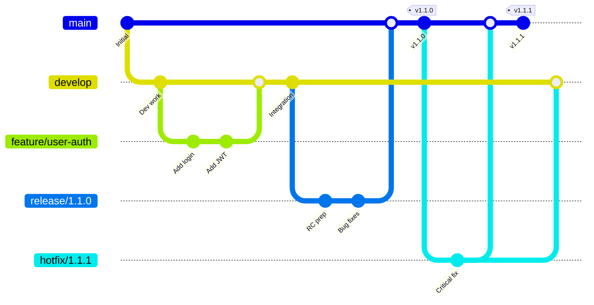
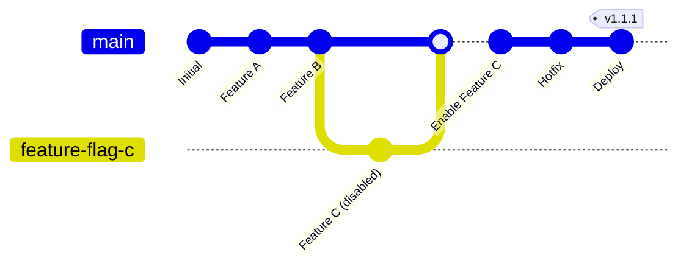

# 🏷️ Versioning, Releases & Branching Strategies - Complete Guide

## 📋 Table of Contents

1. [Version Management Fundamentals](#version-management-fundamentals)
2. [GitFlow Strategy Deep Dive](#gitflow-strategy-deep-dive)
3. [Trunk-Based Development](#trunk-based-development)
4. [Parallel Releases Management](#parallel-releases-management)
5. [Support Branches Strategy](#support-branches-strategy)
6. [Release Tagging Patterns](#release-tagging-patterns)
7. [Hotfix Management](#hotfix-management)
8. [Enterprise Branching Models](#enterprise-branching-models)
9. [Automation & CI/CD Integration](#automation--cicd-integration)
10. [Real-World Examples](#real-world-examples)
11. [Migration Strategies](#migration-strategies)
12. [Best Practices & Anti-Patterns](#best-practices--anti-patterns)

---

## 1. 🎯 Version Management Fundamentals

### Semantic Versioning (SemVer) Deep Dive

#### Basic Format: `MAJOR.MINOR.PATCH[-PRERELEASE][+BUILD]`

```
Examples:
1.0.0         - Initial release
1.0.1         - Patch release (bug fix)
1.1.0         - Minor release (new features, backward compatible)
2.0.0         - Major release (breaking changes)
1.2.0-alpha.1 - Pre-release version
1.2.0+build.123 - Build metadata
```

#### Advanced SemVer Patterns

```bash
# Development versions
1.2.0-dev.20240123.abc123f    # Development snapshot
1.2.0-feature.user-auth.5     # Feature branch version
1.2.0-pr.42.1                 # Pull request version

# Release candidates
2.0.0-rc.1                    # First release candidate
2.0.0-rc.2                    # Second release candidate  
2.0.0                         # Final release

# Hotfix versions
1.1.1                         # Hotfix for 1.1.0
1.1.2                         # Another hotfix
1.2.0                         # Next minor (includes hotfixes)
```

### Version Calculation Algorithms

#### Automated Version Bumping Logic
```yaml
# .github/workflows/version-calculation.yml
name: Version Management
on:
  push:
    branches: [main, develop, 'release/*', 'hotfix/*']

jobs:
  calculate-version:
    runs-on: ubuntu-latest
    outputs:
      version: ${{ steps.version.outputs.version }}
      version-type: ${{ steps.version.outputs.version-type }}
      previous-version: ${{ steps.version.outputs.previous-version }}
    steps:
      - uses: actions/checkout@v4
        with:
          fetch-depth: 0  # Get full history for version calculation

      - name: Calculate next version
        id: version
        run: |
          # Get latest tag
          LATEST_TAG=$(git tag --list --sort=-version:refname | grep -E '^v[0-9]+\.[0-9]+\.[0-9]+$' | head -1)
          if [[ -z "$LATEST_TAG" ]]; then
            LATEST_TAG="v0.0.0"
          fi
          
          # Extract version parts
          CURRENT_VERSION=${LATEST_TAG#v}
          MAJOR=$(echo $CURRENT_VERSION | cut -d. -f1)
          MINOR=$(echo $CURRENT_VERSION | cut -d. -f2)
          PATCH=$(echo $CURRENT_VERSION | cut -d. -f3)
          
          echo "Current version: $CURRENT_VERSION"
          echo "Branch: ${{ github.ref_name }}"
          
          # Determine version bump based on branch and commits
          if [[ "${{ github.ref_name }}" == "main" ]]; then
            # Check commit messages for version bump indicators
            COMMITS=$(git log --oneline $LATEST_TAG..HEAD)
            
            if echo "$COMMITS" | grep -E "(BREAKING CHANGE|!:|feat!:|fix!:)"; then
              # Major version bump
              NEXT_MAJOR=$((MAJOR + 1))
              NEXT_VERSION="$NEXT_MAJOR.0.0"
              VERSION_TYPE="major"
            elif echo "$COMMITS" | grep -E "(feat:|feature:)"; then
              # Minor version bump  
              NEXT_MINOR=$((MINOR + 1))
              NEXT_VERSION="$MAJOR.$NEXT_MINOR.0"
              VERSION_TYPE="minor"
            elif echo "$COMMITS" | grep -E "(fix:|patch:|chore:)"; then
              # Patch version bump
              NEXT_PATCH=$((PATCH + 1))
              NEXT_VERSION="$MAJOR.$MINOR.$NEXT_PATCH"
              VERSION_TYPE="patch"
            else
              # Default to patch
              NEXT_PATCH=$((PATCH + 1))
              NEXT_VERSION="$MAJOR.$MINOR.$NEXT_PATCH"
              VERSION_TYPE="patch"
            fi
            
          elif [[ "${{ github.ref_name }}" =~ ^release/.+ ]]; then
            # Release branch - extract version from branch name
            RELEASE_VERSION="${{ github.ref_name }#release/}"
            if [[ "$RELEASE_VERSION" =~ ^[0-9]+\.[0-9]+\.[0-9]+$ ]]; then
              NEXT_VERSION="$RELEASE_VERSION-rc.${{ github.run_number }}"
              VERSION_TYPE="release-candidate"
            else
              echo "Invalid release branch format"
              exit 1
            fi
            
          elif [[ "${{ github.ref_name }}" =~ ^hotfix/.+ ]]; then
            # Hotfix branch - increment patch version
            NEXT_PATCH=$((PATCH + 1))
            NEXT_VERSION="$MAJOR.$MINOR.$NEXT_PATCH"
            VERSION_TYPE="hotfix"
            
          elif [[ "${{ github.ref_name }}" == "develop" ]]; then
            # Development version
            NEXT_MINOR=$((MINOR + 1))
            NEXT_VERSION="$MAJOR.$NEXT_MINOR.0-dev.${{ github.run_number }}"
            VERSION_TYPE="development"
            
          else
            # Feature branch or other
            BRANCH_SAFE=$(echo "${{ github.ref_name }}" | sed 's/[^a-zA-Z0-9.-]/-/g')
            NEXT_VERSION="$MAJOR.$MINOR.$PATCH-$BRANCH_SAFE.${{ github.run_number }}"
            VERSION_TYPE="feature"
          fi
          
          echo "version=$NEXT_VERSION" >> $GITHUB_OUTPUT
          echo "version-type=$VERSION_TYPE" >> $GITHUB_OUTPUT
          echo "previous-version=$CURRENT_VERSION" >> $GITHUB_OUTPUT
          echo "Next version: $NEXT_VERSION ($VERSION_TYPE)"

      - name: Update version in files
        run: |
          # Update Maven version
          mvn versions:set -DnewVersion=${{ steps.version.outputs.version }} -B
          
          # Update package.json if exists
          if [[ -f package.json ]]; then
            npm version ${{ steps.version.outputs.version }} --no-git-tag-version
          fi
          
          # Update Docker labels
          if [[ -f Dockerfile ]]; then
            sed -i "s/LABEL version=.*/LABEL version=\"${{ steps.version.outputs.version }}\"/" Dockerfile
          fi
```

---

## 2. 🌊 GitFlow Strategy Deep Dive

### Complete GitFlow Implementation



### GitFlow Branch Management Automation

```yaml
# .github/workflows/gitflow-automation.yml
name: GitFlow Automation
on:
  issues:
    types: [opened, labeled]
  pull_request:
    types: [closed]

jobs:
  gitflow-manager:
    runs-on: ubuntu-latest
    steps:
      - uses: actions/checkout@v4
        with:
          token: ${{ secrets.GITHUB_TOKEN }}
          fetch-depth: 0

      - name: Handle release start
        if: >
          github.event_name == 'issues' &&
          (contains(github.event.issue.labels.*.name, 'release:major') ||
           contains(github.event.issue.labels.*.name, 'release:minor'))
        run: |
          # Extract version from issue
          ISSUE_TITLE="${{ github.event.issue.title }}"
          VERSION=$(echo "$ISSUE_TITLE" | grep -oE '[0-9]+\.[0-9]+\.[0-9]+')
          
          if [[ -z "$VERSION" ]]; then
            echo "Could not extract version from issue title"
            exit 1
          fi
          
          echo "Creating release branch for version $VERSION"
          
          # Create release branch from develop
          git checkout develop
          git pull origin develop
          git checkout -b "release/$VERSION"
          
          # Update version in project files
          mvn versions:set -DnewVersion="$VERSION-RC1" -B
          git add .
          git commit -m "chore: Start release $VERSION"
          git push origin "release/$VERSION"
          
          # Create PR from release branch to main
          gh pr create \
            --base main \
            --head "release/$VERSION" \
            --title "Release $VERSION" \
            --body "$(cat << 'EOF'
          ## 🚀 Release $VERSION
          
          This PR contains the release preparation for version $VERSION.
          
          ### 📋 Release Checklist
          - [ ] Version updated in all project files
          - [ ] CHANGELOG.md updated with new features
          - [ ] Documentation updated
          - [ ] All tests pass
          - [ ] Security scan complete
          - [ ] Performance tests pass
          - [ ] Stakeholder approval obtained
          
          ### 🔄 Post-Merge Actions
          - [ ] Tag will be created automatically
          - [ ] Release notes will be published
          - [ ] Artifacts will be built and published
          - [ ] Changes will be merged back to develop
          
          **Issue**: Closes #${{ github.event.issue.number }}
          EOF
          )"

      - name: Handle hotfix start  
        if: >
          github.event_name == 'issues' &&
          contains(github.event.issue.labels.*.name, 'bug:hotfix')
        run: |
          # Get current production version
          LATEST_TAG=$(git tag --list --sort=-version:refname | grep -E '^v[0-9]+\.[0-9]+\.[0-9]+$' | head -1)
          CURRENT_VERSION=${LATEST_TAG#v}
          
          # Calculate hotfix version
          MAJOR=$(echo $CURRENT_VERSION | cut -d. -f1)
          MINOR=$(echo $CURRENT_VERSION | cut -d. -f2)  
          PATCH=$(echo $CURRENT_VERSION | cut -d. -f3)
          HOTFIX_VERSION="$MAJOR.$MINOR.$((PATCH + 1))"
          
          echo "Creating hotfix branch for version $HOTFIX_VERSION"
          
          # Create hotfix branch from main
          git checkout main
          git pull origin main
          git checkout -b "hotfix/$HOTFIX_VERSION"
          
          # Update version
          mvn versions:set -DnewVersion="$HOTFIX_VERSION" -B
          git add .
          git commit -m "chore: Start hotfix $HOTFIX_VERSION"
          git push origin "hotfix/$HOTFIX_VERSION"
          
          # Create PR
          gh pr create \
            --base main \
            --head "hotfix/$HOTFIX_VERSION" \
            --title "🚨 Hotfix $HOTFIX_VERSION" \
            --body "Critical hotfix for production issue #${{ github.event.issue.number }}"

      - name: Handle release completion
        if: >
          github.event_name == 'pull_request' &&
          github.event.pull_request.merged == true &&
          startsWith(github.event.pull_request.head.ref, 'release/')
        run: |
          # Extract version from branch name
          BRANCH_NAME="${{ github.event.pull_request.head.ref }}"
          VERSION=${BRANCH_NAME#release/}
          
          echo "Completing release $VERSION"
          
          # Create and push tag
          git checkout main
          git pull origin main
          git tag -a "v$VERSION" -m "Release version $VERSION"
          git push origin "v$VERSION"
          
          # Merge changes back to develop
          git checkout develop
          git pull origin develop
          git merge main --no-ff -m "chore: Merge release $VERSION back to develop"
          git push origin develop
          
          # Clean up release branch
          git push origin --delete "release/$VERSION"
          
          echo "Release $VERSION completed successfully"
```

### GitFlow Branch Types & Purposes

| Branch Type | Purpose | Source | Target | Lifetime | Version Pattern |
|-------------|---------|--------|--------|----------|-----------------|
| `main/master` | Production code | - | - | Permanent | `v1.2.3` |
| `develop` | Integration | - | - | Permanent | `1.3.0-dev.123` |
| `feature/*` | New features | `develop` | `develop` | Short-term | `1.2.3-feature.auth.45` |
| `release/*` | Release preparation | `develop` | `main` → `develop` | Medium-term | `1.3.0-rc.1` |
| `hotfix/*` | Critical fixes | `main` | `main` → `develop` | Short-term | `1.2.4` |
| `support/*` | Long-term maintenance | `main` | `main` | Long-term | `1.2.x-support` |

---

## 3. 🚀 Trunk-Based Development

### Trunk-Based Strategy Implementation



### Feature Flags Integration

```yaml
# Feature flag configuration
feature-flags:
  user-authentication:
    enabled: false
    rollout-percentage: 0
    environments:
      development: true
      testing: true  
      staging: false
      production: false
    
  payment-gateway-v2:
    enabled: true
    rollout-percentage: 25
    target-groups: ["beta-users", "premium-customers"]
    environments:
      development: true
      testing: true
      staging: true
      production: true
```

### Trunk-Based Workflow

```yaml
# .github/workflows/trunk-based.yml
name: Trunk-Based Development
on:
  push:
    branches: [main]
  pull_request:
    branches: [main]

jobs:
  continuous-integration:
    runs-on: ubuntu-latest
    steps:
      - uses: actions/checkout@v4
      
      - name: Run tests
        run: |
          # All tests must pass for trunk
          mvn test -B
          
      - name: Feature flag validation
        run: |
          # Validate feature flags are properly configured
          ./scripts/validate-feature-flags.sh
          
      - name: Build and test
        if: github.event_name == 'pull_request'
        run: |
          mvn package -B
          docker build -t app:pr-${{ github.event.number }} .
          
      - name: Deploy to production
        if: github.ref == 'refs/heads/main' && github.event_name == 'push'
        run: |
          # Immediate deployment to production
          VERSION=$(date +%Y%m%d.%H%M%S)-${GITHUB_SHA:0:7}
          
          # Build production image
          docker build -t app:$VERSION .
          
          # Deploy with feature flags
          ./scripts/deploy-production.sh $VERSION
          
          # Create deployment tag
          git tag "deploy-$VERSION"
          git push origin "deploy-$VERSION"
```

### Comparison: GitFlow vs Trunk-Based

| Aspect | GitFlow | Trunk-Based |
|--------|---------|-------------|
| **Branches** | Multiple long-lived | Single main branch |
| **Releases** | Planned, batched | Continuous |
| **Integration** | Periodic merges | Constant integration |
| **Feature Development** | Feature branches | Feature flags |
| **Hotfixes** | Dedicated branches | Direct to main |
| **Complexity** | High | Low |
| **Team Size** | Large teams | Small-medium teams |
| **Release Frequency** | Weekly/Monthly | Multiple daily |
| **Risk** | Lower (isolation) | Higher (shared code) |

---

## 4. 🔄 Parallel Releases Management

### Multi-Version Support Strategy

```
Version Timeline:
v1.0.x (LTS) ──────────────────────── (Maintenance)
     │
     └─ v1.1.x (Current) ──────────── (Active Development)
              │
              └─ v1.2.x (Next) ───── (Feature Development)
```

### Parallel Release Implementation

```yaml
# .github/workflows/parallel-releases.yml
name: Parallel Release Management
on:
  workflow_dispatch:
    inputs:
      release-line:
        description: 'Release line to manage'
        required: true
        type: choice
        options:
          - '1.0.x-lts'
          - '1.1.x-current'  
          - '1.2.x-next'
      action:
        description: 'Action to perform'
        required: true
        type: choice
        options:
          - 'create-release'
          - 'apply-hotfix'
          - 'sync-changes'

jobs:
  manage-parallel-releases:
    runs-on: ubuntu-latest
    steps:
      - uses: actions/checkout@v4
        with:
          fetch-depth: 0
          
      - name: Setup release management
        run: |
          RELEASE_LINE="${{ github.event.inputs.release-line }}"
          ACTION="${{ github.event.inputs.action }}"
          
          echo "Managing release line: $RELEASE_LINE"
          echo "Action: $ACTION"
          
          # Define release line configurations
          case "$RELEASE_LINE" in
            "1.0.x-lts")
              BRANCH="support/1.0.x"
              VERSION_PREFIX="1.0"
              SUPPORT_TYPE="lts"
              ;;
            "1.1.x-current")
              BRANCH="release/1.1.x"  
              VERSION_PREFIX="1.1"
              SUPPORT_TYPE="current"
              ;;
            "1.2.x-next")
              BRANCH="develop"
              VERSION_PREFIX="1.2"
              SUPPORT_TYPE="next"
              ;;
          esac
          
          echo "branch=$BRANCH" >> $GITHUB_ENV
          echo "version-prefix=$VERSION_PREFIX" >> $GITHUB_ENV
          echo "support-type=$SUPPORT_TYPE" >> $GITHUB_ENV

      - name: Create release
        if: github.event.inputs.action == 'create-release'
        run: |
          git checkout ${{ env.branch }}
          
          # Calculate next version in this release line
          LATEST_TAG=$(git tag --list --sort=-version:refname | grep "^v${{ env.version-prefix }}" | head -1)
          if [[ -z "$LATEST_TAG" ]]; then
            NEXT_VERSION="${{ env.version-prefix }}.0"
          else
            CURRENT_VERSION=${LATEST_TAG#v}
            PATCH=$(echo $CURRENT_VERSION | cut -d. -f3)
            NEXT_PATCH=$((PATCH + 1))
            NEXT_VERSION="${{ env.version-prefix }}.$NEXT_PATCH"
          fi
          
          echo "Creating release $NEXT_VERSION for ${{ env.support-type }}"
          
          # Update version and create release
          mvn versions:set -DnewVersion="$NEXT_VERSION" -B
          git add .
          git commit -m "chore: Release $NEXT_VERSION"
          git tag -a "v$NEXT_VERSION" -m "Release $NEXT_VERSION (${{ env.support-type }})"
          git push origin ${{ env.branch }}
          git push origin "v$NEXT_VERSION"

      - name: Apply hotfix
        if: github.event.inputs.action == 'apply-hotfix'
        run: |
          # Apply hotfix to specific release line
          echo "Applying hotfix to ${{ env.branch }}"
          
          # This would typically involve:
          # 1. Cherry-picking commits from main
          # 2. Creating patch release
          # 3. Testing in isolation
          # 4. Publishing release
          
          git checkout ${{ env.branch }}
          
          # Example: Apply latest hotfix commit
          HOTFIX_COMMIT=$(git log main --oneline --grep="hotfix" -n 1 | cut -d' ' -f1)
          if [[ -n "$HOTFIX_COMMIT" ]]; then
            git cherry-pick $HOTFIX_COMMIT
            echo "Applied hotfix commit: $HOTFIX_COMMIT"
          fi

      - name: Sync changes between release lines
        if: github.event.inputs.action == 'sync-changes'
        run: |
          # Sync compatible changes between release lines
          echo "Syncing changes for ${{ env.support-type }} release line"
          
          case "${{ env.support-type }}" in
            "lts")
              # Only security and critical fixes
              echo "Syncing critical fixes to LTS"
              ;;
            "current")  
              # Bug fixes and some features
              echo "Syncing features and fixes to current"
              ;;
            "next")
              # All changes
              echo "Syncing all changes to next"
              ;;
          esac
```

### Release Line Matrix

| Release Line | Type | Support Duration | Update Frequency | Change Types |
|--------------|------|------------------|------------------|--------------|
| `1.0.x` | LTS | 2+ years | Monthly | Security, Critical fixes |
| `1.1.x` | Current | 6 months | Bi-weekly | Bug fixes, Minor features |
| `1.2.x` | Next | 3 months | Weekly | All changes, Breaking changes |
| `2.0.x` | Future | - | - | Major rewrite |

---

## 5. 🛠️ Support Branches Strategy

### Long-Term Support Implementation

```yaml
# Support branch creation
name: Create Support Branch
on:
  workflow_dispatch:
    inputs:
      version:
        description: 'Version to create support branch for (e.g., 1.0.0)'
        required: true
        type: string
      support-duration:
        description: 'Support duration in months'
        required: true
        type: number
        default: 24

jobs:
  create-support-branch:
    runs-on: ubuntu-latest
    steps:
      - uses: actions/checkout@v4
        with:
          fetch-depth: 0
          
      - name: Create support branch
        run: |
          VERSION="${{ github.event.inputs.version }}"
          DURATION="${{ github.event.inputs.support-duration }}"
          
          # Validate version exists
          if ! git tag --list | grep -q "^v$VERSION$"; then
            echo "Version v$VERSION does not exist"
            exit 1
          fi
          
          # Extract major.minor for branch name
          MAJOR_MINOR=$(echo $VERSION | cut -d. -f1,2)
          SUPPORT_BRANCH="support/$MAJOR_MINOR.x"
          
          echo "Creating support branch: $SUPPORT_BRANCH"
          
          # Create branch from version tag
          git checkout "v$VERSION"
          git checkout -b "$SUPPORT_BRANCH"
          
          # Add support branch metadata
          cat > .support-branch.yml << EOF
          version-line: $MAJOR_MINOR.x
          base-version: $VERSION
          created-date: $(date -u +%Y-%m-%dT%H:%M:%SZ)
          support-until: $(date -u -d "+$DURATION months" +%Y-%m-%dT%H:%M:%SZ)
          support-type: lts
          allowed-changes:
            - security-fixes
            - critical-bugs
            - documentation-updates
          maintainers:
            - devops-team
          EOF
          
          git add .support-branch.yml
          git commit -m "chore: Initialize support branch for $MAJOR_MINOR.x"
          git push origin "$SUPPORT_BRANCH"
          
          # Create GitHub issue to track support branch
          gh issue create \
            --title "Support Branch: $SUPPORT_BRANCH" \
            --body "$(cat << 'EOF'
          ## 🛠️ Long-Term Support Branch
          
          **Version Line**: $MAJOR_MINOR.x  
          **Base Version**: v$VERSION  
          **Support Duration**: $DURATION months
          **Created**: $(date)
          
          ### Maintenance Schedule
          - [ ] Monthly security updates
          - [ ] Quarterly dependency updates  
          - [ ] Critical bug fixes as needed
          
          ### Allowed Changes
          - Security fixes
          - Critical bug fixes
          - Documentation updates
          - Dependency security updates
          
          ### Not Allowed
          - New features
          - Breaking changes
          - Performance optimizations
          - Code refactoring
          
          **Maintainers**: @devops-team
          EOF
          )" \
            --label "support-branch,lts"

      - name: Setup support branch protection
        run: |
          MAJOR_MINOR=$(echo ${{ github.event.inputs.version }} | cut -d. -f1,2)
          SUPPORT_BRANCH="support/$MAJOR_MINOR.x"
          
          # Apply branch protection rules
          gh api repos/${{ github.repository }}/branches/$SUPPORT_BRANCH/protection \
            --method PUT \
            --input - << 'EOF'
          {
            "required_status_checks": {
              "strict": true,
              "contexts": ["Security scan", "Critical tests only"]
            },
            "enforce_admins": true,
            "required_pull_request_reviews": {
              "required_approving_review_count": 2,
              "dismiss_stale_reviews": true,
              "require_code_owner_reviews": true
            },
            "restrictions": {
              "users": [],
              "teams": ["devops-team", "security-team"]
            },
            "allow_force_pushes": false,
            "allow_deletions": false
          }
          EOF
```

### Support Branch Maintenance

```yaml
# .github/workflows/support-branch-maintenance.yml
name: Support Branch Maintenance
on:
  schedule:
    - cron: '0 2 * * 1'  # Weekly on Mondays
  workflow_dispatch:
    inputs:
      branch:
        description: 'Support branch to maintain'
        required: true
        type: string

jobs:
  maintain-support-branches:
    runs-on: ubuntu-latest
    steps:
      - uses: actions/checkout@v4
        with:
          fetch-depth: 0
          
      - name: Identify support branches
        id: branches
        run: |
          if [[ -n "${{ github.event.inputs.branch }}" ]]; then
            BRANCHES="${{ github.event.inputs.branch }}"
          else
            BRANCHES=$(git branch -r | grep 'origin/support/' | sed 's/origin\///' | tr '\n' ' ')
          fi
          
          echo "branches=$BRANCHES" >> $GITHUB_OUTPUT
          echo "Support branches to maintain: $BRANCHES"

      - name: Security updates check
        run: |
          for BRANCH in ${{ steps.branches.outputs.branches }}; do
            echo "Checking security updates for $BRANCH"
            git checkout "$BRANCH"
            
            # Check for security vulnerabilities
            if [[ -f pom.xml ]]; then
              mvn dependency-check:aggregate -DfailBuildOnCVSS=7 || true
            fi
            
            # Check for outdated dependencies with security issues
            if [[ -f package.json ]]; then
              npm audit --audit-level=moderate || true
            fi
            
            # Generate security report
            echo "## Security Report for $BRANCH" > "security-report-$BRANCH.md"
            echo "Generated: $(date)" >> "security-report-$BRANCH.md"
          done

      - name: Apply critical patches
        run: |
          # This would typically involve:
          # 1. Scanning for critical security patches
          # 2. Testing compatibility
          # 3. Creating patch releases
          # 4. Notifying stakeholders
          
          echo "Critical patch application would happen here"

      - name: End-of-life check
        run: |
          for BRANCH in ${{ steps.branches.outputs.branches }}; do
            git checkout "$BRANCH"
            
            if [[ -f .support-branch.yml ]]; then
              SUPPORT_UNTIL=$(grep 'support-until:' .support-branch.yml | cut -d' ' -f2)
              CURRENT_DATE=$(date -u +%Y-%m-%dT%H:%M:%SZ)
              
              if [[ "$CURRENT_DATE" > "$SUPPORT_UNTIL" ]]; then
                echo "⚠️  Support branch $BRANCH has reached end-of-life"
                
                # Create EOL notification issue
                gh issue create \
                  --title "🚨 End-of-Life: $BRANCH" \
                  --body "Support branch $BRANCH has reached its end-of-life date ($SUPPORT_UNTIL). Consider migration to a newer version." \
                  --label "eol,support-branch"
              fi
            fi
          done
```

---

## 6. 🏷️ Release Tagging Patterns

### Advanced Tagging Strategies

#### Hierarchical Tagging System
```bash
# Production releases
v1.2.3              # Stable release
v1.2.3-hotfix.1     # Hotfix release

# Pre-releases  
v1.3.0-alpha.1      # Alpha release
v1.3.0-beta.2       # Beta release
v1.3.0-rc.3         # Release candidate

# Environment-specific tags
staging/v1.2.3      # Deployed to staging
production/v1.2.3   # Deployed to production

# Feature releases
v1.2.3-feature.auth # Feature-specific release

# Build artifacts
v1.2.3+build.456    # Build metadata
v1.2.3+sha.abc123f  # Git SHA metadata
```

#### Automated Tagging Workflow

```yaml
# .github/workflows/automated-tagging.yml
name: Automated Tagging
on:
  push:
    branches: [main]
  workflow_dispatch:
    inputs:
      tag-type:
        description: 'Type of tag to create'
        required: true
        type: choice
        options:
          - 'patch'
          - 'minor'  
          - 'major'
          - 'prerelease'
      prerelease-type:
        description: 'Pre-release type (alpha, beta, rc)'
        required: false
        type: string

jobs:
  create-tag:
    runs-on: ubuntu-latest
    outputs:
      tag: ${{ steps.tag.outputs.tag }}
      changelog: ${{ steps.changelog.outputs.changelog }}
    steps:
      - uses: actions/checkout@v4
        with:
          fetch-depth: 0
          
      - name: Calculate tag
        id: tag
        run: |
          # Get latest tag
          LATEST_TAG=$(git tag --list --sort=-version:refname | grep -E '^v[0-9]+\.[0-9]+\.[0-9]+' | head -1)
          if [[ -z "$LATEST_TAG" ]]; then
            LATEST_TAG="v0.0.0"
          fi
          
          CURRENT_VERSION=${LATEST_TAG#v}
          MAJOR=$(echo $CURRENT_VERSION | cut -d. -f1)
          MINOR=$(echo $CURRENT_VERSION | cut -d. -f2)
          PATCH=$(echo $CURRENT_VERSION | cut -d. -f3 | cut -d- -f1)
          
          TAG_TYPE="${{ github.event.inputs.tag-type }}"
          if [[ -z "$TAG_TYPE" ]]; then
            # Auto-determine based on commits
            COMMITS=$(git log --oneline $LATEST_TAG..HEAD)
            if echo "$COMMITS" | grep -E "(BREAKING CHANGE|!:)"; then
              TAG_TYPE="major"
            elif echo "$COMMITS" | grep -E "(feat:|feature:)"; then
              TAG_TYPE="minor"
            else
              TAG_TYPE="patch"
            fi
          fi
          
          case "$TAG_TYPE" in
            "major")
              NEXT_VERSION="$((MAJOR + 1)).0.0"
              ;;
            "minor")
              NEXT_VERSION="$MAJOR.$((MINOR + 1)).0"
              ;;
            "patch")
              NEXT_VERSION="$MAJOR.$MINOR.$((PATCH + 1))"
              ;;
            "prerelease")
              PRERELEASE_TYPE="${{ github.event.inputs.prerelease-type }}"
              if [[ -z "$PRERELEASE_TYPE" ]]; then
                PRERELEASE_TYPE="alpha"
              fi
              
              # Check if there's already a prerelease
              PRERELEASE_TAG=$(git tag --list --sort=-version:refname | grep -E "^v$MAJOR\.$MINOR\.$PATCH-$PRERELEASE_TYPE\." | head -1)
              if [[ -n "$PRERELEASE_TAG" ]]; then
                PRERELEASE_NUM=$(echo $PRERELEASE_TAG | grep -oE '[0-9]+$')
                NEXT_PRERELEASE_NUM=$((PRERELEASE_NUM + 1))
              else
                NEXT_PRERELEASE_NUM=1
              fi
              
              NEXT_VERSION="$MAJOR.$MINOR.$PATCH-$PRERELEASE_TYPE.$NEXT_PRERELEASE_NUM"
              ;;
          esac
          
          TAG="v$NEXT_VERSION"
          echo "tag=$TAG" >> $GITHUB_OUTPUT
          echo "Next tag: $TAG"

      - name: Generate changelog
        id: changelog
        run: |
          TAG="${{ steps.tag.outputs.tag }}"
          LATEST_TAG=$(git tag --list --sort=-version:refname | grep -E '^v[0-9]+\.[0-9]+\.[0-9]+' | head -1)
          
          echo "Generating changelog from $LATEST_TAG to HEAD"
          
          # Generate changelog
          CHANGELOG=$(git log --oneline --pretty=format:"- %s (%h)" $LATEST_TAG..HEAD)
          
          # Categorize commits
          FEATURES=$(echo "$CHANGELOG" | grep -E "(feat:|feature:)" || echo "")
          FIXES=$(echo "$CHANGELOG" | grep -E "(fix:|bug:|patch:)" || echo "")
          CHORES=$(echo "$CHANGELOG" | grep -E "(chore:|docs:|style:)" || echo "")
          BREAKING=$(echo "$CHANGELOG" | grep -E "(BREAKING|!:)" || echo "")
          
          # Create formatted changelog
          FORMATTED_CHANGELOG="## $TAG\n\n"
          
          if [[ -n "$BREAKING" ]]; then
            FORMATTED_CHANGELOG+="### ⚠️  BREAKING CHANGES\n$BREAKING\n\n"
          fi
          
          if [[ -n "$FEATURES" ]]; then
            FORMATTED_CHANGELOG+="### ✨ Features\n$FEATURES\n\n"
          fi
          
          if [[ -n "$FIXES" ]]; then
            FORMATTED_CHANGELOG+="### 🐛 Bug Fixes\n$FIXES\n\n"
          fi
          
          if [[ -n "$CHORES" ]]; then
            FORMATTED_CHANGELOG+="### 🔧 Maintenance\n$CHORES\n\n"
          fi
          
          # Save changelog to file
          echo -e "$FORMATTED_CHANGELOG" > changelog.md
          
          # Output for use in other steps
          echo "changelog<<EOF" >> $GITHUB_OUTPUT
          echo -e "$FORMATTED_CHANGELOG" >> $GITHUB_OUTPUT
          echo "EOF" >> $GITHUB_OUTPUT

      - name: Create and push tag
        run: |
          TAG="${{ steps.tag.outputs.tag }}"
          
          # Configure git
          git config user.name "github-actions[bot]"
          git config user.email "github-actions[bot]@users.noreply.github.com"
          
          # Create annotated tag with changelog
          git tag -a "$TAG" -m "Release $TAG" -m "${{ steps.changelog.outputs.changelog }}"
          git push origin "$TAG"
          
          echo "Created and pushed tag: $TAG"

      - name: Create GitHub release
        uses: actions/github-script@v6
        with:
          script: |
            const tag = '${{ steps.tag.outputs.tag }}';
            const changelog = `${{ steps.changelog.outputs.changelog }}`;
            
            const isPrerelease = tag.includes('-alpha') || tag.includes('-beta') || tag.includes('-rc');
            
            const release = await github.rest.repos.createRelease({
              owner: context.repo.owner,
              repo: context.repo.repo,
              tag_name: tag,
              name: tag,
              body: changelog,
              draft: false,
              prerelease: isPrerelease
            });
            
            console.log(`Created release: ${release.data.html_url}`);

      - name: Update changelog file
        run: |
          # Update CHANGELOG.md file
          if [[ -f CHANGELOG.md ]]; then
            # Prepend new changelog to existing file
            cp CHANGELOG.md CHANGELOG.md.bak
            echo -e "${{ steps.changelog.outputs.changelog }}" > CHANGELOG.md
            cat CHANGELOG.md.bak >> CHANGELOG.md
            rm CHANGELOG.md.bak
          else
            # Create new changelog file
            echo -e "${{ steps.changelog.outputs.changelog }}" > CHANGELOG.md
          fi
          
          # Commit updated changelog
          git add CHANGELOG.md
          git commit -m "docs: Update CHANGELOG for ${{ steps.tag.outputs.tag }}"
          git push origin main
```

### Tag Naming Conventions

```bash
# Standard releases
v1.0.0, v1.1.0, v2.0.0

# Pre-releases
v1.1.0-alpha.1      # Alpha version
v1.1.0-beta.2       # Beta version  
v1.1.0-rc.3         # Release candidate

# Hotfixes
v1.0.1, v1.0.2      # Patch releases

# Environment deployments
staging/v1.0.0      # Staging deployment
production/v1.0.0   # Production deployment  

# Feature releases (for parallel development)
v1.0.0-feature.auth # Feature-specific release

# Support releases
v1.0.0-lts          # Long-term support
v1.0.1-security     # Security patch

# Build metadata (not for sorting)
v1.0.0+build.123    # Build number
v1.0.0+sha.abc123f  # Git commit SHA
v1.0.0+date.20240123 # Build date
```

---

## 7. 🚨 Hotfix Management

### Emergency Hotfix Workflow

```yaml
# .github/workflows/emergency-hotfix.yml
name: Emergency Hotfix
on:
  workflow_dispatch:
    inputs:
      severity:
        description: 'Hotfix severity'
        required: true
        type: choice
        options:
          - 'critical'    # Production down
          - 'high'        # Major functionality broken
          - 'medium'      # Minor functionality broken
      description:
        description: 'Brief description of the issue'
        required: true
        type: string
      affected-versions:
        description: 'Affected versions (comma-separated)'
        required: true
        type: string

jobs:
  emergency-hotfix:
    runs-on: ubuntu-latest
    environment: production
    steps:
      - uses: actions/checkout@v4
        with:
          fetch-depth: 0
          token: ${{ secrets.GITHUB_TOKEN }}
          
      - name: Validate emergency conditions
        run: |
          SEVERITY="${{ github.event.inputs.severity }}"
          
          # Only allow critical/high severity during business hours
          # Critical can run 24/7
          CURRENT_HOUR=$(date +%H)
          if [[ "$SEVERITY" != "critical" && ($CURRENT_HOUR -lt 9 || $CURRENT_HOUR -gt 17) ]]; then
            echo "Non-critical hotfixes only allowed during business hours (9-17 UTC)"
            exit 1
          fi
          
          echo "Emergency hotfix approved for $SEVERITY severity"

      - name: Create hotfix branches
        run: |
          AFFECTED_VERSIONS="${{ github.event.inputs.affected-versions }}"
          DESCRIPTION="${{ github.event.inputs.description }}"
          TIMESTAMP=$(date +%Y%m%d-%H%M%S)
          
          echo "Creating hotfix branches for versions: $AFFECTED_VERSIONS"
          
          for VERSION in $(echo $AFFECTED_VERSIONS | tr ',' ' '); do
            # Remove 'v' prefix if present
            CLEAN_VERSION=${VERSION#v}
            
            # Check if version exists
            if ! git tag --list | grep -q "^v$CLEAN_VERSION$"; then
              echo "Version v$CLEAN_VERSION does not exist, skipping"
              continue
            fi
            
            # Calculate hotfix version
            MAJOR=$(echo $CLEAN_VERSION | cut -d. -f1)
            MINOR=$(echo $CLEAN_VERSION | cut -d. -f2)
            PATCH=$(echo $CLEAN_VERSION | cut -d. -f3)
            HOTFIX_VERSION="$MAJOR.$MINOR.$((PATCH + 1))"
            
            # Create hotfix branch
            HOTFIX_BRANCH="hotfix/$HOTFIX_VERSION-emergency-$TIMESTAMP"
            
            echo "Creating hotfix branch: $HOTFIX_BRANCH"
            git checkout "v$CLEAN_VERSION"
            git checkout -b "$HOTFIX_BRANCH"
            
            # Update version
            mvn versions:set -DnewVersion="$HOTFIX_VERSION" -B
            
            # Create emergency hotfix commit
            git add .
            git commit -m "chore: Emergency hotfix $HOTFIX_VERSION - $DESCRIPTION"
            git push origin "$HOTFIX_BRANCH"
            
            # Create emergency PR with expedited review
            gh pr create \
              --base main \
              --head "$HOTFIX_BRANCH" \
              --title "🚨 EMERGENCY HOTFIX $HOTFIX_VERSION" \
              --body "$(cat << EOF
          ## 🚨 EMERGENCY HOTFIX
          
          **Severity**: ${{ github.event.inputs.severity }}
          **Description**: $DESCRIPTION
          **Affected Version**: v$CLEAN_VERSION
          **Hotfix Version**: v$HOTFIX_VERSION
          **Created**: $(date)
          
          ### ⚠️ EMERGENCY APPROVAL REQUIRED
          
          This is an emergency hotfix that requires immediate attention.
          
          ### 🔍 Quick Validation Checklist
          - [ ] Fix addresses the critical issue
          - [ ] No unrelated changes included
          - [ ] Basic smoke tests pass
          - [ ] Security implications reviewed
          
          ### 🚀 Post-Merge Actions
          - [ ] Immediate deployment to production
          - [ ] Monitor system health
          - [ ] Post-incident review scheduled
          - [ ] Merge back to develop branch
          
          **Requires approval from**: @devops-team @security-team
          EOF
          )" \
              --label "hotfix,emergency,${{ github.event.inputs.severity }}"
          done

      - name: Notify stakeholders
        uses: actions/github-script@v6
        with:
          script: |
            const severity = '${{ github.event.inputs.severity }}';
            const description = '${{ github.event.inputs.description }}';
            
            // Create incident issue
            const incident = await github.rest.issues.create({
              owner: context.repo.owner,
              repo: context.repo.repo,
              title: `🚨 Production Incident - ${severity.toUpperCase()}`,
              body: `
              ## Production Incident Report
              
              **Severity**: ${severity}
              **Description**: ${description}
              **Time**: ${new Date().toISOString()}
              **Status**: Hotfix in progress
              
              ### Timeline
              - ${new Date().toISOString()}: Incident detected
              - ${new Date().toISOString()}: Emergency hotfix workflow started
              
              ### Actions Taken
              - Emergency hotfix branches created
              - Pull requests opened for review
              - Stakeholders notified
              
              ### Next Steps
              - [ ] Code review and approval
              - [ ] Emergency deployment
              - [ ] System monitoring
              - [ ] Post-incident review
              `,
              labels: ['incident', 'production', severity]
            });
            
            console.log(`Created incident issue: ${incident.data.html_url}`);

  auto-deploy:
    needs: emergency-hotfix
    if: github.event.inputs.severity == 'critical'
    runs-on: ubuntu-latest
    environment: production
    steps:
      - name: Monitor for PR approval
        run: |
          echo "Monitoring for emergency PR approval..."
          # This would typically involve:
          # 1. Waiting for required approvals
          # 2. Running emergency deployment pipeline
          # 3. Monitoring system health
          # 4. Rollback if issues detected
```

### Hotfix Testing Strategy

```yaml
# Minimal but essential tests for hotfixes
hotfix-tests:
  runs-on: ubuntu-latest
  steps:
    - uses: actions/checkout@v4
    
    - name: Critical path tests only
      run: |
        # Only run tests related to the hotfix
        mvn test -Dtest=**/*CriticalTest -B
        
        # Smoke tests
        mvn test -Dtest=**/*SmokeTest -B
        
        # Security regression tests
        mvn test -Dtest=**/*SecurityTest -B

    - name: Performance regression check
      run: |
        # Ensure hotfix doesn't degrade performance
        ./scripts/performance-regression-check.sh

    - name: Integration health check
      run: |
        # Test critical integrations still work
        ./scripts/integration-health-check.sh
```

---

## 8. 🏢 Enterprise Branching Models

### Multi-Product Enterprise Model

```
Product A (Web)     Product B (Mobile)   Product C (API)
     │                    │                   │
   main ←─────────────── main ←─────────────main
     │                    │                   │
  develop ←─────────── develop ←─────────── develop
     │                    │                   │
 feature/*           feature/*           feature/*
```

### Monorepo Branching Strategy

```yaml
# .github/workflows/monorepo-branching.yml
name: Monorepo Branch Management
on:
  push:
    paths:
      - 'services/auth/**'
      - 'services/payment/**'
      - 'services/notification/**'
      - 'shared/**'

jobs:
  detect-changes:
    runs-on: ubuntu-latest
    outputs:
      auth: ${{ steps.changes.outputs.auth }}
      payment: ${{ steps.changes.outputs.payment }}
      notification: ${{ steps.changes.outputs.notification }}
      shared: ${{ steps.changes.outputs.shared }}
    steps:
      - uses: actions/checkout@v4
        with:
          fetch-depth: 2
          
      - uses: dorny/paths-filter@v2
        id: changes
        with:
          filters: |
            auth:
              - 'services/auth/**'
            payment:
              - 'services/payment/**'
            notification:
              - 'services/notification/**'
            shared:
              - 'shared/**'

  service-versioning:
    needs: detect-changes
    runs-on: ubuntu-latest
    strategy:
      matrix:
        service: [auth, payment, notification]
        include:
          - service: auth
            changed: ${{ needs.detect-changes.outputs.auth }}
          - service: payment
            changed: ${{ needs.detect-changes.outputs.payment }}
          - service: notification
            changed: ${{ needs.detect-changes.outputs.notification }}
    steps:
      - uses: actions/checkout@v4
        if: matrix.changed == 'true' || needs.detect-changes.outputs.shared == 'true'
        
      - name: Calculate service version
        if: matrix.changed == 'true' || needs.detect-changes.outputs.shared == 'true'
        run: |
          SERVICE=${{ matrix.service }}
          
          # Get latest tag for this service
          LATEST_TAG=$(git tag --list --sort=-version:refname | grep "^$SERVICE-v" | head -1)
          if [[ -z "$LATEST_TAG" ]]; then
            NEXT_VERSION="$SERVICE-v1.0.0"
          else
            CURRENT_VERSION=${LATEST_TAG#$SERVICE-v}
            # Calculate next version based on changes
            if [[ "${{ needs.detect-changes.outputs.shared }}" == "true" ]]; then
              # Shared changes affect all services - minor bump
              MAJOR=$(echo $CURRENT_VERSION | cut -d. -f1)
              MINOR=$(echo $CURRENT_VERSION | cut -d. -f2)
              NEXT_VERSION="$SERVICE-v$MAJOR.$((MINOR + 1)).0"
            else
              # Service-specific change - patch bump
              MAJOR=$(echo $CURRENT_VERSION | cut -d. -f1)
              MINOR=$(echo $CURRENT_VERSION | cut -d. -f2)
              PATCH=$(echo $CURRENT_VERSION | cut -d. -f3)
              NEXT_VERSION="$SERVICE-v$MAJOR.$MINOR.$((PATCH + 1))"
            fi
          fi
          
          echo "Service $SERVICE version: $NEXT_VERSION"
          
          # Tag if on main branch
          if [[ "${{ github.ref_name }}" == "main" ]]; then
            git tag "$NEXT_VERSION"
            git push origin "$NEXT_VERSION"
          fi
```

### Multi-Team Coordination

```yaml
# .github/workflows/team-coordination.yml
name: Multi-Team Coordination
on:
  pull_request:
    types: [opened, labeled]

jobs:
  coordinate-teams:
    runs-on: ubuntu-latest
    steps:
      - uses: actions/checkout@v4
        
      - name: Analyze changes for team coordination
        id: analysis
        run: |
          # Analyze which teams are affected by changes
          CHANGED_FILES=$(git diff --name-only origin/main...HEAD)
          
          AFFECTED_TEAMS=""
          
          # Backend team
          if echo "$CHANGED_FILES" | grep -E "(src/main/java|src/test/java|pom.xml)"; then
            AFFECTED_TEAMS="$AFFECTED_TEAMS @backend-team"
          fi
          
          # Frontend team  
          if echo "$CHANGED_FILES" | grep -E "(src/main/resources/static|package.json)"; then
            AFFECTED_TEAMS="$AFFECTED_TEAMS @frontend-team"
          fi
          
          # DevOps team
          if echo "$CHANGED_FILES" | grep -E "(.github|Dockerfile|docker-compose|terraform)"; then
            AFFECTED_TEAMS="$AFFECTED_TEAMS @devops-team"
          fi
          
          # Security team
          if echo "$CHANGED_FILES" | grep -E "(security|auth|crypto)"; then
            AFFECTED_TEAMS="$AFFECTED_TEAMS @security-team"
          fi
          
          echo "affected-teams=$AFFECTED_TEAMS" >> $GITHUB_OUTPUT

      - name: Request cross-team reviews
        if: steps.analysis.outputs.affected-teams != ''
        uses: actions/github-script@v6
        with:
          script: |
            const affectedTeams = '${{ steps.analysis.outputs.affected-teams }}';
            
            await github.rest.issues.createComment({
              issue_number: context.issue.number,
              owner: context.repo.owner,
              repo: context.repo.repo,
              body: `
              ## 🤝 Cross-Team Coordination Required
              
              This pull request affects multiple teams and requires coordination:
              
              **Affected Teams**: ${affectedTeams}
              
              ### 📋 Coordination Checklist
              - [ ] Technical design reviewed by all affected teams
              - [ ] API contracts agreed upon (if applicable)
              - [ ] Database changes coordinated (if applicable)
              - [ ] Deployment sequence planned
              - [ ] Testing strategy agreed upon
              - [ ] Documentation updated for all teams
              
              **Please ensure all affected teams have reviewed and approved before merging.**
              `
            });
```

---

## 9. 🔄 Automation & CI/CD Integration

### Complete Version Management Pipeline

```yaml
# .github/workflows/version-pipeline.yml
name: Complete Version Management Pipeline
on:
  push:
    branches: [main, develop, 'release/*', 'hotfix/*']
    tags: ['v*']

jobs:
  version-management:
    runs-on: ubuntu-latest
    outputs:
      version: ${{ steps.version.outputs.version }}
      changed: ${{ steps.version.outputs.changed }}
      tag-created: ${{ steps.version.outputs.tag-created }}
    steps:
      - uses: actions/checkout@v4
        with:
          fetch-depth: 0
          token: ${{ secrets.GITHUB_TOKEN }}
          
      - name: Configure Git
        run: |
          git config user.name "github-actions[bot]"
          git config user.email "github-actions[bot]@users.noreply.github.com"

      - name: Calculate and apply version
        id: version
        run: |
          source .github/scripts/version-management.sh
          
          # This script would contain comprehensive version logic
          calculate_version_from_context
          apply_version_to_project_files
          create_or_update_changelog
          
          if should_create_tag; then
            create_version_tag
            echo "tag-created=true" >> $GITHUB_OUTPUT
          else
            echo "tag-created=false" >> $GITHUB_OUTPUT
          fi

      - name: Update project files
        if: steps.version.outputs.changed == 'true'
        run: |
          # Update all version references
          VERSION="${{ steps.version.outputs.version }}"
          
          # Maven
          mvn versions:set -DnewVersion="$VERSION" -B
          
          # Package.json
          if [[ -f package.json ]]; then
            npm version "$VERSION" --no-git-tag-version
          fi
          
          # Docker
          if [[ -f Dockerfile ]]; then
            sed -i "s/LABEL version=.*/LABEL version=\"$VERSION\"/" Dockerfile
          fi
          
          # Kubernetes manifests
          find k8s/ -name "*.yml" -o -name "*.yaml" | xargs sed -i "s/image:.*:v.*/image: myapp:v$VERSION/"
          
          # Helm chart
          if [[ -f Chart.yaml ]]; then
            sed -i "s/version:.*/version: $VERSION/" Chart.yaml
            sed -i "s/appVersion:.*/appVersion: $VERSION/" Chart.yaml
          fi
          
          # Commit version changes
          git add .
          git commit -m "chore: Update version to $VERSION [skip ci]" || true
          git push origin ${{ github.ref_name }}

  build-and-publish:
    needs: version-management
    if: needs.version-management.outputs.tag-created == 'true'
    runs-on: ubuntu-latest
    strategy:
      matrix:
        platform: [linux/amd64, linux/arm64]
    steps:
      - uses: actions/checkout@v4
        
      - name: Build artifacts
        run: |
          VERSION="${{ needs.version-management.outputs.version }}"
          PLATFORM="${{ matrix.platform }}"
          
          echo "Building version $VERSION for platform $PLATFORM"
          
          # Build application
          mvn clean package -DskipTests -B
          
          # Build Docker image
          docker buildx build \
            --platform $PLATFORM \
            --tag myapp:v$VERSION-$(echo $PLATFORM | tr '/' '-') \
            --tag myapp:latest-$(echo $PLATFORM | tr '/' '-') \
            .

      - name: Publish artifacts
        run: |
          VERSION="${{ needs.version-management.outputs.version }}"
          
          # Push to container registry
          docker push myapp:v$VERSION-$(echo ${{ matrix.platform }} | tr '/' '-')
          
          # Upload to artifact repository
          # mvn deploy -DskipTests -B

  deploy-environments:
    needs: [version-management, build-and-publish]
    if: needs.version-management.outputs.tag-created == 'true'
    runs-on: ubuntu-latest
    strategy:
      matrix:
        environment: [staging, production]
        include:
          - environment: staging
            branch: develop
          - environment: production
            branch: main
    steps:
      - name: Deploy to environment
        if: (matrix.environment == 'staging' && github.ref_name == 'develop') || (matrix.environment == 'production' && github.ref_name == 'main')
        run: |
          VERSION="${{ needs.version-management.outputs.version }}"
          ENVIRONMENT="${{ matrix.environment }}"
          
          echo "Deploying version $VERSION to $ENVIRONMENT"
          
          # Update deployment manifests
          kubectl set image deployment/myapp myapp=myapp:v$VERSION -n $ENVIRONMENT
          
          # Wait for rollout
          kubectl rollout status deployment/myapp -n $ENVIRONMENT --timeout=300s

  notification:
    needs: [version-management, build-and-publish, deploy-environments]
    if: always()
    runs-on: ubuntu-latest
    steps:
      - name: Send notifications
        run: |
          VERSION="${{ needs.version-management.outputs.version }}"
          SUCCESS="${{ needs.deploy-environments.result == 'success' }}"
          
          if [[ "$SUCCESS" == "true" ]]; then
            MESSAGE="✅ Successfully released version $VERSION"
          else
            MESSAGE="❌ Failed to release version $VERSION"
          fi
          
          # Send to Slack
          curl -X POST -H 'Content-type: application/json' \
            --data "{\"text\":\"$MESSAGE\"}" \
            ${{ secrets.SLACK_WEBHOOK_URL }}
```

### Version Management Scripts

Create a comprehensive version management script:

```bash
# .github/scripts/version-management.sh
#!/bin/bash

set -euo pipefail

# Global variables
CURRENT_BRANCH=""
LATEST_TAG=""
NEXT_VERSION=""
VERSION_TYPE=""

# Function to get the latest semantic version tag
get_latest_tag() {
    LATEST_TAG=$(git tag --list --sort=-version:refname | grep -E '^v[0-9]+\.[0-9]+\.[0-9]+$' | head -1)
    if [[ -z "$LATEST_TAG" ]]; then
        LATEST_TAG="v0.0.0"
    fi
    echo "Latest tag: $LATEST_TAG"
}

# Function to parse version components
parse_version() {
    local version=${1#v}  # Remove 'v' prefix
    MAJOR=$(echo $version | cut -d. -f1)
    MINOR=$(echo $version | cut -d. -f2)
    PATCH=$(echo $version | cut -d. -f3 | cut -d- -f1)
    
    echo "Parsed version: MAJOR=$MAJOR, MINOR=$MINOR, PATCH=$PATCH"
}

# Function to analyze commits for version bump type
analyze_commits() {
    local commit_range="$LATEST_TAG..HEAD"
    local commits=$(git log --oneline --pretty=format:"%s" $commit_range)
    
    if echo "$commits" | grep -qE "(BREAKING CHANGE|!:|feat!:|fix!:)"; then
        VERSION_TYPE="major"
    elif echo "$commits" | grep -qE "(feat:|feature:)"; then
        VERSION_TYPE="minor"
    elif echo "$commits" | grep -qE "(fix:|patch:|chore:)"; then
        VERSION_TYPE="patch"
    else
        VERSION_TYPE="patch"  # Default
    fi
    
    echo "Version bump type: $VERSION_TYPE"
}

# Function to calculate next version based on branch and commits
calculate_version_from_context() {
    get_latest_tag
    parse_version "$LATEST_TAG"
    
    CURRENT_BRANCH=$(git branch --show-current)
    echo "Current branch: $CURRENT_BRANCH"
    
    case "$CURRENT_BRANCH" in
        "main"|"master")
            analyze_commits
            case "$VERSION_TYPE" in
                "major")
                    NEXT_VERSION="$((MAJOR + 1)).0.0"
                    ;;
                "minor")
                    NEXT_VERSION="$MAJOR.$((MINOR + 1)).0"
                    ;;
                "patch")
                    NEXT_VERSION="$MAJOR.$MINOR.$((PATCH + 1))"
                    ;;
            esac
            ;;
        "develop")
            # Development version
            NEXT_MINOR=$((MINOR + 1))
            NEXT_VERSION="$MAJOR.$NEXT_MINOR.0-dev.$(date +%Y%m%d).${GITHUB_RUN_NUMBER:-1}"
            VERSION_TYPE="development"
            ;;
        release/*)
            # Extract version from branch name
            RELEASE_VERSION=${CURRENT_BRANCH#release/}
            if [[ "$RELEASE_VERSION" =~ ^[0-9]+\.[0-9]+\.[0-9]+$ ]]; then
                NEXT_VERSION="$RELEASE_VERSION-rc.${GITHUB_RUN_NUMBER:-1}"
                VERSION_TYPE="release-candidate"
            else
                echo "Error: Invalid release branch format"
                exit 1
            fi
            ;;
        hotfix/*)
            # Extract version from branch name or calculate
            HOTFIX_VERSION=${CURRENT_BRANCH#hotfix/}
            if [[ "$HOTFIX_VERSION" =~ ^[0-9]+\.[0-9]+\.[0-9]+$ ]]; then
                NEXT_VERSION="$HOTFIX_VERSION"
            else
                NEXT_VERSION="$MAJOR.$MINOR.$((PATCH + 1))"
            fi
            VERSION_TYPE="hotfix"
            ;;
        *)
            # Feature branch or other
            BRANCH_SAFE=$(echo "$CURRENT_BRANCH" | sed 's/[^a-zA-Z0-9.-]/-/g')
            NEXT_VERSION="$MAJOR.$MINOR.$PATCH-$BRANCH_SAFE.${GITHUB_RUN_NUMBER:-1}"
            VERSION_TYPE="feature"
            ;;
    esac
    
    echo "Next version: $NEXT_VERSION"
    echo "version=$NEXT_VERSION" >> $GITHUB_OUTPUT
    echo "version-type=$VERSION_TYPE" >> $GITHUB_OUTPUT
}

# Function to check if version files need updating
version_changed() {
    if [[ -f pom.xml ]]; then
        CURRENT_POM_VERSION=$(mvn help:evaluate -Dexpression=project.version -q -DforceStdout)
        if [[ "$CURRENT_POM_VERSION" != "$NEXT_VERSION" ]]; then
            echo "changed=true" >> $GITHUB_OUTPUT
            return 0
        fi
    fi
    
    echo "changed=false" >> $GITHUB_OUTPUT
    return 1
}

# Function to apply version to project files
apply_version_to_project_files() {
    echo "Applying version $NEXT_VERSION to project files"
    
    # Check if version actually changed
    if version_changed; then
        echo "Version changed, updating files"
    else
        echo "Version unchanged, skipping file updates"
        return 0
    fi
    
    # Maven pom.xml
    if [[ -f pom.xml ]]; then
        mvn versions:set -DnewVersion="$NEXT_VERSION" -B
        echo "Updated Maven version"
    fi
    
    # Node.js package.json
    if [[ -f package.json ]]; then
        npm version "$NEXT_VERSION" --no-git-tag-version
        echo "Updated Node.js version"
    fi
    
    # Docker Dockerfile
    if [[ -f Dockerfile ]]; then
        if grep -q "LABEL version=" Dockerfile; then
            sed -i "s/LABEL version=.*/LABEL version=\"$NEXT_VERSION\"/" Dockerfile
        else
            echo "LABEL version=\"$NEXT_VERSION\"" >> Dockerfile
        fi
        echo "Updated Docker version label"
    fi
    
    # Kubernetes manifests
    if [[ -d k8s/ ]]; then
        find k8s/ -name "*.yml" -o -name "*.yaml" | while read -r file; do
            if grep -q "image:.*:" "$file"; then
                sed -i "s|image: \(.*\):.*|image: \1:v$NEXT_VERSION|" "$file"
            fi
        done
        echo "Updated Kubernetes manifests"
    fi
    
    # Helm Chart.yaml
    if [[ -f Chart.yaml ]]; then
        sed -i "s/^version:.*/version: $NEXT_VERSION/" Chart.yaml
        sed -i "s/^appVersion:.*/appVersion: v$NEXT_VERSION/" Chart.yaml
        echo "Updated Helm chart version"
    fi
}

# Function to update changelog
create_or_update_changelog() {
    local changelog_file="CHANGELOG.md"
    local temp_changelog="CHANGELOG.tmp"
    
    echo "Updating changelog for version $NEXT_VERSION"
    
    # Generate changelog entry
    {
        echo "## [$NEXT_VERSION] - $(date +%Y-%m-%d)"
        echo ""
        
        if [[ "$VERSION_TYPE" == "major" ]]; then
            echo "### ⚠️ BREAKING CHANGES"
            git log --oneline --grep="BREAKING CHANGE" --grep="!:" "$LATEST_TAG..HEAD" | sed 's/^/- /'
            echo ""
        fi
        
        echo "### ✨ Features"
        git log --oneline --grep="feat:" --grep="feature:" "$LATEST_TAG..HEAD" | sed 's/^/- /'
        echo ""
        
        echo "### 🐛 Bug Fixes"  
        git log --oneline --grep="fix:" --grep="bug:" "$LATEST_TAG..HEAD" | sed 's/^/- /'
        echo ""
        
        echo "### 🔧 Maintenance"
        git log --oneline --grep="chore:" --grep="docs:" --grep="style:" "$LATEST_TAG..HEAD" | sed 's/^/- /'
        echo ""
        
    } > "$temp_changelog"
    
    # Prepend to existing changelog or create new one
    if [[ -f "$changelog_file" ]]; then
        cat "$changelog_file" >> "$temp_changelog"
    fi
    
    mv "$temp_changelog" "$changelog_file"
    echo "Changelog updated"
}

# Function to determine if a tag should be created
should_create_tag() {
    case "$VERSION_TYPE" in
        "major"|"minor"|"patch"|"hotfix")
            # Only create tags for main releases and hotfixes
            if [[ "$CURRENT_BRANCH" == "main" || "$CURRENT_BRANCH" == "master" || "$CURRENT_BRANCH" =~ ^hotfix/.* ]]; then
                return 0
            fi
            ;;
        "release-candidate")
            # Create tags for release candidates
            return 0
            ;;
    esac
    return 1
}

# Function to create version tag
create_version_tag() {
    local tag="v$NEXT_VERSION"
    
    echo "Creating tag: $tag"
    
    # Create annotated tag
    git tag -a "$tag" -m "Release version $NEXT_VERSION"
    git push origin "$tag"
    
    echo "Tag $tag created and pushed"
}

# Main execution (only if script is run directly)
if [[ "${BASH_SOURCE[0]}" == "${0}" ]]; then
    calculate_version_from_context
    apply_version_to_project_files
    create_or_update_changelog
    
    if should_create_tag; then
        create_version_tag
    fi
fi
```

---

## 10. 📊 Real-World Examples

### Enterprise E-commerce Platform Example

```yaml
# Real scenario: Multi-service e-commerce platform
# Products: Web App, Mobile API, Payment Service, Inventory Service

name: E-commerce Platform Release
on:
  push:
    branches: [main]
    paths:
      - 'services/web-app/**'
      - 'services/mobile-api/**'  
      - 'services/payment/**'
      - 'services/inventory/**'
      - 'shared/**'

jobs:
  detect-service-changes:
    runs-on: ubuntu-latest
    outputs:
      web-app: ${{ steps.changes.outputs.web-app }}
      mobile-api: ${{ steps.changes.outputs.mobile-api }}
      payment: ${{ steps.changes.outputs.payment }}
      inventory: ${{ steps.changes.outputs.inventory }}
      shared: ${{ steps.changes.outputs.shared }}
      deployment-strategy: ${{ steps.strategy.outputs.deployment-strategy }}
    steps:
      - uses: actions/checkout@v4
        with:
          fetch-depth: 2
          
      - uses: dorny/paths-filter@v2
        id: changes
        with:
          filters: |
            web-app:
              - 'services/web-app/**'
            mobile-api:
              - 'services/mobile-api/**'
            payment:
              - 'services/payment/**'
            inventory:
              - 'services/inventory/**'
            shared:
              - 'shared/**'
              
      - name: Determine deployment strategy
        id: strategy
        run: |
          # Critical services require special deployment strategy
          STRATEGY="standard"
          
          if [[ "${{ steps.changes.outputs.payment }}" == "true" ]]; then
            STRATEGY="blue-green"  # Payment changes require zero-downtime
          elif [[ "${{ steps.changes.outputs.shared }}" == "true" ]]; then
            STRATEGY="canary"      # Shared changes need gradual rollout
          fi
          
          echo "deployment-strategy=$STRATEGY" >> $GITHUB_OUTPUT

  version-and-build:
    needs: detect-service-changes
    runs-on: ubuntu-latest
    strategy:
      matrix:
        service: [web-app, mobile-api, payment, inventory]
        include:
          - service: web-app
            changed: ${{ needs.detect-service-changes.outputs.web-app }}
          - service: mobile-api  
            changed: ${{ needs.detect-service-changes.outputs.mobile-api }}
          - service: payment
            changed: ${{ needs.detect-service-changes.outputs.payment }}
          - service: inventory
            changed: ${{ needs.detect-service-changes.outputs.inventory }}
    steps:
      - uses: actions/checkout@v4
        if: matrix.changed == 'true' || needs.detect-service-changes.outputs.shared == 'true'
        
      - name: Calculate service version
        if: matrix.changed == 'true' || needs.detect-service-changes.outputs.shared == 'true'
        run: |
          SERVICE=${{ matrix.service }}
          SHARED_CHANGED=${{ needs.detect-service-changes.outputs.shared }}
          
          # Get latest service tag
          LATEST_TAG=$(git tag --list --sort=-version:refname | grep "^$SERVICE-v" | head -1)
          
          if [[ -z "$LATEST_TAG" ]]; then
            NEXT_VERSION="1.0.0"
          else
            CURRENT_VERSION=${LATEST_TAG#$SERVICE-v}
            MAJOR=$(echo $CURRENT_VERSION | cut -d. -f1)
            MINOR=$(echo $CURRENT_VERSION | cut -d. -f2)
            PATCH=$(echo $CURRENT_VERSION | cut -d. -f3)
            
            # Version bump logic based on service criticality and changes
            if [[ "$SERVICE" == "payment" && "$SHARED_CHANGED" == "true" ]]; then
              # Payment service with shared changes = minor bump (more testing needed)
              NEXT_VERSION="$MAJOR.$((MINOR + 1)).0"
            elif [[ "$SHARED_CHANGED" == "true" ]]; then
              # Shared changes = minor bump for all services
              NEXT_VERSION="$MAJOR.$((MINOR + 1)).0"
            else
              # Service-specific changes = patch bump
              NEXT_VERSION="$MAJOR.$MINOR.$((PATCH + 1))"
            fi
          fi
          
          echo "SERVICE_VERSION=$NEXT_VERSION" >> $GITHUB_ENV
          echo "Service $SERVICE will be version $NEXT_VERSION"
          
          # Create service tag
          SERVICE_TAG="$SERVICE-v$NEXT_VERSION"
          git tag "$SERVICE_TAG"
          git push origin "$SERVICE_TAG"

  coordinated-deployment:
    needs: [detect-service-changes, version-and-build]
    runs-on: ubuntu-latest
    steps:
      - name: Deploy with coordination
        run: |
          STRATEGY="${{ needs.detect-service-changes.outputs.deployment-strategy }}"
          
          echo "Executing $STRATEGY deployment strategy"
          
          case "$STRATEGY" in
            "blue-green")
              # Blue-green deployment for critical services
              echo "Deploying to blue environment..."
              # Deploy to blue environment
              # Run health checks
              # Switch traffic to blue
              # Keep green as fallback
              ;;
            "canary")
              # Canary deployment for shared changes
              echo "Starting canary deployment..."
              # Deploy to 5% of traffic
              # Monitor metrics for 10 minutes
              # Gradually increase to 100%
              ;;
            "standard")
              # Standard rolling deployment
              echo "Standard rolling deployment..."
              # Rolling update with health checks
              ;;
          esac

  integration-tests:
    needs: coordinated-deployment
    runs-on: ubuntu-latest
    steps:
      - name: Run cross-service integration tests
        run: |
          # Test service interactions after deployment
          ./scripts/integration-tests.sh
          
          # Test critical user journeys
          ./scripts/e2e-tests.sh
          
          # Performance regression tests
          ./scripts/performance-tests.sh

  rollback-on-failure:
    needs: [coordinated-deployment, integration-tests]
    if: failure()
    runs-on: ubuntu-latest
    steps:
      - name: Emergency rollback
        run: |
          echo "Deployment failed, initiating rollback..."
          
          # Get previous versions
          # Rollback each affected service
          # Verify rollback success
          # Notify stakeholders
```

### Financial Services Example (Highly Regulated)

```yaml
# Financial services with compliance requirements
name: Financial Services Release
on:
  push:
    branches: [main]

jobs:
  compliance-checks:
    runs-on: ubuntu-latest
    steps:
      - uses: actions/checkout@v4
        
      - name: Regulatory compliance scan
        run: |
          # PCI DSS compliance check
          ./scripts/pci-compliance-check.sh
          
          # SOX compliance verification
          ./scripts/sox-compliance-check.sh
          
          # GDPR data handling verification
          ./scripts/gdpr-compliance-check.sh

      - name: Financial calculations verification
        run: |
          # Verify financial calculation accuracy
          # Run regression tests on critical financial logic
          # Validate against known test cases
          mvn test -Dtest=**/*FinancialTest -B

      - name: Audit trail creation
        run: |
          # Create detailed audit trail
          AUDIT_ENTRY="$(date): Release process started for commit $GITHUB_SHA"
          echo "$AUDIT_ENTRY" >> audit.log
          
          # Store in immutable audit system
          ./scripts/store-audit-entry.sh "$AUDIT_ENTRY"

  security-review:
    needs: compliance-checks
    runs-on: ubuntu-latest
    steps:
      - name: Security team approval
        uses: actions/github-script@v6
        with:
          script: |
            // Check for security team approval
            const reviews = await github.rest.pulls.listReviews({
              owner: context.repo.owner,
              repo: context.repo.repo,
              pull_number: context.issue.number
            });
            
            const securityApproval = reviews.data.some(review => 
              review.user.login.includes('security-team') && 
              review.state === 'APPROVED'
            );
            
            if (!securityApproval) {
              core.setFailed('Security team approval required for financial services deployment');
            }

  staged-deployment:
    needs: [compliance-checks, security-review]
    runs-on: ubuntu-latest
    strategy:
      matrix:
        environment: [staging, production]
    steps:
      - name: Deploy with manual approval gates
        if: matrix.environment == 'production'
        uses: actions/github-script@v6
        with:
          script: |
            // Require manual approval for production
            const approval = await github.rest.issues.createComment({
              issue_number: context.issue.number,
              owner: context.repo.owner,
              repo: context.repo.repo,
              body: '🚨 Production deployment requires manual approval from @financial-controllers'
            });
            
            // Wait for approval (would be handled by external system)

      - name: Financial services deployment
        run: |
          ENVIRONMENT=${{ matrix.environment }}
          
          # Deployment with extra safeguards
          ./scripts/financial-deploy.sh $ENVIRONMENT
          
          # Post-deployment verification
          ./scripts/financial-verification.sh $ENVIRONMENT
          
          # Compliance reporting
          ./scripts/compliance-report.sh $ENVIRONMENT
```

### Healthcare Platform Example (HIPAA Compliant)

```yaml
# Healthcare platform with HIPAA compliance
name: Healthcare Platform Release
on:
  push:
    branches: [main]
    paths:
      - 'patient-data/**'
      - 'medical-records/**'
      - 'billing/**'

jobs:
  hipaa-compliance:
    runs-on: ubuntu-latest
    steps:
      - uses: actions/checkout@v4
        
      - name: PHI data protection verification
        run: |
          # Ensure no PHI in code or configs
          ./scripts/phi-scan.sh
          
          # Verify encryption of sensitive data
          ./scripts/encryption-verification.sh
          
          # Check access controls
          ./scripts/access-control-check.sh

      - name: Medical device integration testing
        run: |
          # Test integration with medical devices
          # Verify data accuracy and integrity
          # Check real-time monitoring capabilities
          ./scripts/medical-device-tests.sh

  clinical-validation:
    needs: hipaa-compliance
    runs-on: ubuntu-latest
    steps:
      - name: Clinical workflow testing
        run: |
          # Test clinical decision support
          # Verify medical calculations
          # Check drug interaction warnings
          ./scripts/clinical-workflow-tests.sh

      - name: Disaster recovery testing
        run: |
          # Test backup and recovery procedures
          # Verify data integrity after recovery
          # Test failover capabilities
          ./scripts/disaster-recovery-tests.sh

  deployment-with-monitoring:
    needs: [hipaa-compliance, clinical-validation]
    runs-on: ubuntu-latest
    steps:
      - name: Healthcare deployment
        run: |
          # Deploy with enhanced monitoring
          ./scripts/healthcare-deploy.sh
          
          # Enable real-time monitoring
          ./scripts/enable-monitoring.sh
          
          # Set up alerting for critical systems
          ./scripts/setup-critical-alerts.sh
```

---

## 11. 🔄 Migration Strategies

### GitFlow to Trunk-Based Migration

```yaml
# .github/workflows/migration-gitflow-to-trunk.yml
name: Migration - GitFlow to Trunk-Based
on:
  workflow_dispatch:
    inputs:
      migration-phase:
        description: 'Migration phase'
        required: true
        type: choice
        options:
          - 'phase1-preparation'
          - 'phase2-feature-flags'
          - 'phase3-branch-consolidation'
          - 'phase4-cleanup'

jobs:
  migration-manager:
    runs-on: ubuntu-latest
    steps:
      - uses: actions/checkout@v4
        with:
          fetch-depth: 0
          
      - name: Phase 1 - Preparation
        if: github.event.inputs.migration-phase == 'phase1-preparation'
        run: |
          echo "Phase 1: Preparing for GitFlow to Trunk-Based migration"
          
          # 1. Audit current branch structure
          echo "Current branches:"
          git branch -a
          
          # 2. Identify long-running feature branches
          echo "Long-running feature branches:"
          git for-each-ref --format='%(refname:short) %(committerdate) %(authorname)' refs/remotes/origin/feature/ | sort -k2
          
          # 3. Create migration plan
          cat > migration-plan.md << 'EOF'
          # GitFlow to Trunk-Based Migration Plan
          
          ## Current State Analysis
          - Main branch: main
          - Development branch: develop  
          - Feature branches: $(git branch -r | grep feature | wc -l)
          - Release branches: $(git branch -r | grep release | wc -l)
          - Hotfix branches: $(git branch -r | grep hotfix | wc -l)
          
          ## Migration Phases
          1. **Preparation**: Team training, feature flag setup
          2. **Feature Flags**: Implement feature toggles
          3. **Branch Consolidation**: Merge long-running branches
          4. **Cleanup**: Remove old branches and update processes
          
          ## Success Criteria
          - All code in main branch
          - Feature flags operational
          - CI/CD pipeline updated
          - Team trained on new process
          EOF
          
          # 4. Set up feature flag framework
          echo "Setting up feature flag framework..."
          
          # 5. Create training materials
          echo "Creating training materials for team..."

      - name: Phase 2 - Feature Flags Implementation
        if: github.event.inputs.migration-phase == 'phase2-feature-flags'
        run: |
          echo "Phase 2: Implementing feature flags"
          
          # 1. Add feature flag configuration
          mkdir -p config/feature-flags
          cat > config/feature-flags/flags.yaml << 'EOF'
          feature-flags:
            new-user-dashboard:
              enabled: false
              environments: [development, testing]
              rollout-percentage: 0
            
            payment-gateway-v2:
              enabled: false  
              environments: [development]
              rollout-percentage: 0
              
            mobile-app-redesign:
              enabled: false
              environments: []
              rollout-percentage: 0
          EOF
          
          # 2. Update application to use feature flags
          echo "Updating application code for feature flags..."
          
          # 3. Test feature flag toggling
          echo "Testing feature flag functionality..."

      - name: Phase 3 - Branch Consolidation
        if: github.event.inputs.migration-phase == 'phase3-branch-consolidation'
        run: |
          echo "Phase 3: Consolidating branches"
          
          # 1. Identify branches to merge
          FEATURE_BRANCHES=$(git branch -r | grep "origin/feature/" | sed 's/origin\///')
          
          for BRANCH in $FEATURE_BRANCHES; do
            echo "Processing branch: $BRANCH"
            
            # Check if branch is active (commits in last 30 days)
            LAST_COMMIT=$(git log -1 --format="%ct" "$BRANCH" 2>/dev/null || echo "0")
            THIRTY_DAYS_AGO=$(date -d "30 days ago" +%s)
            
            if [[ $LAST_COMMIT -gt $THIRTY_DAYS_AGO ]]; then
              echo "Active branch $BRANCH - needs attention"
              # Create issue for branch owner
              AUTHOR=$(git log -1 --format="%ae" "$BRANCH")
              gh issue create \
                --title "Migration: Merge feature branch $BRANCH" \
                --body "Feature branch $BRANCH needs to be merged or converted to feature flag before migration completion." \
                --assignee "$AUTHOR"
            else
              echo "Inactive branch $BRANCH - marking for deletion"
            fi
          done
          
          # 2. Merge develop into main
          git checkout main
          git pull origin main
          git merge origin/develop --no-ff -m "chore: Merge develop branch for trunk-based migration"
          git push origin main
          
          # 3. Update default branch
          gh repo edit --default-branch main

      - name: Phase 4 - Cleanup
        if: github.event.inputs.migration-phase == 'phase4-cleanup'
        run: |
          echo "Phase 4: Cleanup and finalization"
          
          # 1. Remove old branches
          git push origin --delete develop || echo "Develop branch already deleted"
          
          # Delete merged feature branches
          git branch -r --merged main | grep "origin/feature/" | sed 's/origin\///' | while read BRANCH; do
            echo "Deleting merged branch: $BRANCH"
            git push origin --delete "$BRANCH" || echo "Branch $BRANCH already deleted"
          done
          
          # 2. Update CI/CD workflows
          echo "Updating CI/CD workflows for trunk-based development..."
          
          # 3. Update documentation
          cat > DEVELOPMENT_WORKFLOW.md << 'EOF'
          # Development Workflow - Trunk-Based Development
          
          We've migrated from GitFlow to Trunk-Based Development.
          
          ## New Process
          1. Create feature branch from main
          2. Implement feature behind feature flag
          3. Create PR to main
          4. Merge to main after review
          5. Deploy to production with feature flag disabled
          6. Enable feature flag when ready
          
          ## Feature Flags
          All new features must be behind feature flags.
          See `config/feature-flags/flags.yaml` for configuration.
          
          ## Deployment
          - All commits to main are automatically deployed
          - Use feature flags to control feature visibility
          - Rollback by disabling feature flags
          EOF
          
          git add .
          git commit -m "docs: Update development workflow for trunk-based development"
          git push origin main
          
          # 4. Migration complete notification
          gh issue create \
            --title "✅ Migration to Trunk-Based Development Complete" \
            --body "Successfully migrated from GitFlow to Trunk-Based Development. All teams should now follow the new workflow documented in DEVELOPMENT_WORKFLOW.md"
```

### Legacy System Version Migration

```yaml
# Migrating from legacy version system to semantic versioning
name: Legacy to SemVer Migration
on:
  workflow_dispatch:
    inputs:
      current-version:
        description: 'Current legacy version (e.g., Build-2023.45)'
        required: true
        type: string
      target-semver:
        description: 'Target semantic version (e.g., 1.0.0)'
        required: true
        type: string

jobs:
  version-migration:
    runs-on: ubuntu-latest
    steps:
      - uses: actions/checkout@v4
        with:
          fetch-depth: 0
          
      - name: Analyze legacy version history
        run: |
          CURRENT_VERSION="${{ github.event.inputs.current-version }}"
          TARGET_VERSION="${{ github.event.inputs.target-semver }}"
          
          echo "Migrating from legacy version: $CURRENT_VERSION"
          echo "Target semantic version: $TARGET_VERSION"
          
          # 1. Analyze existing version tags
          echo "Existing version tags:"
          git tag --list | grep -E "(Build|Release|Version)" | sort -V
          
          # 2. Create version mapping
          cat > version-mapping.json << EOF
          {
            "legacy-format": "$CURRENT_VERSION",
            "semver-format": "$TARGET_VERSION",
            "migration-date": "$(date -u +%Y-%m-%dT%H:%M:%SZ)",
            "mapping-rules": {
              "major": "Breaking changes or yearly releases",
              "minor": "Feature releases or quarterly updates", 
              "patch": "Bug fixes or monthly builds"
            }
          }
          EOF

      - name: Update version in all files
        run: |
          TARGET_VERSION="${{ github.event.inputs.target-semver }}"
          
          echo "Updating version to $TARGET_VERSION in all project files"
          
          # Update common files
          files_to_update=(
            "pom.xml"
            "package.json" 
            "setup.py"
            "Cargo.toml"
            "build.gradle"
            "version.txt"
            "VERSION"
          )
          
          for file in "${files_to_update[@]}"; do
            if [[ -f "$file" ]]; then
              echo "Updating $file"
              case "$file" in
                "pom.xml")
                  mvn versions:set -DnewVersion="$TARGET_VERSION" -B
                  ;;
                "package.json")
                  npm version "$TARGET_VERSION" --no-git-tag-version
                  ;;
                "setup.py")
                  sed -i "s/version=.*/version='$TARGET_VERSION',/" "$file"
                  ;;
                "Cargo.toml")
                  sed -i "s/version = .*/version = \"$TARGET_VERSION\"/" "$file"
                  ;;
                "build.gradle")
                  sed -i "s/version = .*/version = '$TARGET_VERSION'/" "$file"
                  ;;
                "version.txt"|"VERSION")
                  echo "$TARGET_VERSION" > "$file"
                  ;;
              esac
            fi
          done
          
          # Update documentation
          find . -name "*.md" -exec sed -i "s/${{ github.event.inputs.current-version }}/$TARGET_VERSION/g" {} \;

      - name: Create migration commit and tag
        run: |
          TARGET_VERSION="${{ github.event.inputs.target-semver }}"
          
          # Configure git
          git config user.name "github-actions[bot]"
          git config user.email "github-actions[bot]@users.noreply.github.com"
          
          # Commit changes
          git add .
          git commit -m "chore: Migrate to semantic versioning

          - Migrate from legacy version ${{ github.event.inputs.current-version }}
          - Adopt semantic versioning starting with v$TARGET_VERSION
          - Update all project files with new version format
          - Add version mapping documentation"
          
          # Create semantic version tag
          git tag -a "v$TARGET_VERSION" -m "First semantic version release

          Migrated from legacy versioning system.
          Previous version: ${{ github.event.inputs.current-version }}
          
          This release establishes semantic versioning baseline for future releases."
          
          # Push changes and tag
          git push origin main
          git push origin "v$TARGET_VERSION"

      - name: Update CI/CD for semantic versioning
        run: |
          echo "Updating CI/CD pipelines for semantic versioning"
          
          # Update workflows to use semantic versioning
          find .github/workflows/ -name "*.yml" -exec sed -i 's/Build-[0-9]*/v[0-9]*\.[0-9]*\.[0-9]*/g' {} \;
          
          # Add semantic versioning automation
          cat > .github/workflows/semantic-versioning.yml << 'EOF'
          name: Semantic Versioning
          on:
            push:
              branches: [main]
          
          jobs:
            version-bump:
              runs-on: ubuntu-latest
              steps:
                - uses: actions/checkout@v4
                  with:
                    fetch-depth: 0
                    
                - name: Calculate next version
                  run: |
                    # Semantic version calculation logic
                    LATEST_TAG=$(git tag --list --sort=-version:refname | grep '^v[0-9]*\.[0-9]*\.[0-9]*$' | head -1)
                    echo "Latest tag: $LATEST_TAG"
                    
                    # Version bump based on commit messages
                    # Implementation would go here
          EOF
          
          git add .github/workflows/semantic-versioning.yml
          git commit -m "ci: Add semantic versioning automation"
          git push origin main

      - name: Migration validation
        run: |
          TARGET_VERSION="${{ github.event.inputs.target-semver }}"
          
          echo "Validating version migration..."
          
          # 1. Verify tag was created
          if git tag --list | grep -q "^v$TARGET_VERSION$"; then
            echo "✅ Semantic version tag created successfully"
          else
            echo "❌ Failed to create semantic version tag"
            exit 1
          fi
          
          # 2. Verify project files updated
          if mvn help:evaluate -Dexpression=project.version -q -DforceStdout 2>/dev/null | grep -q "$TARGET_VERSION"; then
            echo "✅ Maven version updated successfully"
          fi
          
          # 3. Create validation report
          cat > migration-report.md << EOF
          # Version Migration Report
          
          **Date**: $(date)
          **From**: ${{ github.event.inputs.current-version }}
          **To**: v$TARGET_VERSION
          
          ## ✅ Completed Tasks
          - [x] Updated project version files
          - [x] Created semantic version tag
          - [x] Updated documentation
          - [x] Updated CI/CD workflows
          - [x] Created version mapping documentation
          
          ## 📋 Next Steps
          1. Update deployment scripts to use semantic versions
          2. Train team on new versioning strategy  
          3. Update release documentation
          4. Configure automated version bumping
          
          ## 🔗 References
          - [Semantic Versioning Specification](https://semver.org/)
          - [Version Migration Guide](./version-mapping.json)
          EOF
          
          echo "Migration validation complete"
```

---

## 12. ✅ Best Practices & Anti-Patterns

### Best Practices Summary

#### Version Management
```yaml
# ✅ DO: Use semantic versioning consistently
v1.2.3              # Clear, semantic version
v1.2.3-rc.1         # Pre-release with identifier
v1.2.3+build.456    # Build metadata when needed

# ❌ DON'T: Use arbitrary version numbers  
v20230415           # Date-based (hard to compare)
v1.2.3.4.5         # Too many segments
vFinal              # Non-semantic identifier
```

#### Branch Management
```yaml
# ✅ DO: Clear branch naming conventions
feature/user-authentication
release/1.2.0
hotfix/1.1.1
support/1.0.x

# ❌ DON'T: Unclear or inconsistent names
my-feature
fix
temp-branch
branch-123
```

#### Tagging Strategy
```yaml
# ✅ DO: Consistent tag formatting with metadata
- Annotated tags with release notes
- Environment-specific tags for tracking
- Automated tag creation with validation

# ❌ DON'T: Manual or inconsistent tagging
- Lightweight tags without context
- Missing tags for releases  
- Inconsistent naming schemes
```

### Anti-Patterns to Avoid

#### ❌ Anti-Pattern 1: Manual Version Management
```yaml
# BAD: Manual version updates
name: Manual Release
on:
  workflow_dispatch:
    inputs:
      version:
        description: 'Enter version manually'
        required: true

# GOOD: Automated version calculation
name: Automated Release  
on:
  push:
    branches: [main]
jobs:
  auto-version:
    steps:
      - name: Calculate version from commits
        run: |
          # Automated version calculation based on conventional commits
```

#### ❌ Anti-Pattern 2: Long-Lived Feature Branches
```yaml
# BAD: Feature branch from 6 months ago
feature/big-rewrite (created 6 months ago, 500+ commits behind main)

# GOOD: Short-lived feature branches with feature flags
feature/user-auth (created 2 days ago, feature flag controlled)
```

#### ❌ Anti-Pattern 3: Inconsistent Environment Versioning
```yaml
# BAD: Different versions in different environments
staging: v1.2.0
production: v1.1.5  
development: v1.3.0-alpha

# GOOD: Clear promotion path
development: v1.3.0-dev.123
staging: v1.2.0
production: v1.2.0
```

#### ❌ Anti-Pattern 4: Missing Rollback Strategy
```yaml
# BAD: No rollback plan
deploy:
  steps:
    - name: Deploy to production
      run: kubectl apply -f production.yaml
    # No rollback strategy

# GOOD: Rollback capability
deploy:
  steps:
    - name: Deploy with rollback capability
      run: |
        kubectl apply -f production.yaml
        kubectl rollout status deployment/app
        # Store previous version for rollback
        echo "previous-version=$(kubectl get deployment app -o jsonpath='{.metadata.labels.version}')" >> $GITHUB_ENV
    
    - name: Rollback on failure
      if: failure()
      run: |
        kubectl rollout undo deployment/app
        kubectl rollout status deployment/app
```

#### ❌ Anti-Pattern 5: No Version Validation
```yaml
# BAD: Deploy without validation
- name: Deploy
  run: docker run myapp:latest

# GOOD: Version validation  
- name: Validate and deploy
  run: |
    # Validate version exists and is expected
    if ! docker pull myapp:v$VERSION; then
      echo "Version v$VERSION does not exist"
      exit 1
    fi
    
    # Deploy specific version
    docker run myapp:v$VERSION
```

### Production-Ready Checklist

#### Pre-Release Validation
- [ ] **Version Calculated Correctly**: Automated version follows semantic versioning rules
- [ ] **All Tests Pass**: Unit, integration, and end-to-end tests complete successfully
- [ ] **Security Scan Clean**: No critical or high severity vulnerabilities
- [ ] **Performance Validated**: No performance regression detected
- [ ] **Documentation Updated**: CHANGELOG.md and API docs reflect changes
- [ ] **Feature Flags Ready**: New features properly gated with feature flags
- [ ] **Rollback Plan**: Clear rollback procedure documented and tested
- [ ] **Monitoring Setup**: Alerts and monitoring configured for new version

#### Post-Release Validation
- [ ] **Health Checks Pass**: All application health endpoints responding
- [ ] **Integration Tests**: Cross-service communication working
- [ ] **User Acceptance**: Critical user journeys functional
- [ ] **Performance Metrics**: Response times within acceptable ranges
- [ ] **Error Rates**: No unusual error rate increases
- [ ] **Resource Usage**: CPU/Memory usage within expected bounds
- [ ] **Database Performance**: No database performance degradation
- [ ] **Third-Party Integrations**: External service connections healthy

### Emergency Procedures

#### Hotfix Response Process
```yaml
# 1. Immediate Assessment (5 minutes)
- Severity classification (Critical/High/Medium)
- Impact assessment (users affected, services down)
- Root cause identification (if obvious)

# 2. Emergency Response (15 minutes)
- Create hotfix branch from production
- Implement minimal fix
- Emergency testing (smoke tests only)
- Fast-track review process

# 3. Deployment (10 minutes)
- Deploy to production with monitoring
- Verify fix effectiveness
- Document incident timeline
- Notify stakeholders

# 4. Post-Incident (24 hours)
- Merge hotfix back to main branches
- Conduct post-mortem review
- Update prevention measures
- Document lessons learned
```

This comprehensive guide provides everything needed to master versioning, releases, and branching strategies for enterprise DevOps. Use it as both a learning resource and operational reference for production systems.

Would you like me to commit this comprehensive versioning and branching guide to your repository?